---
## Front matter
lang: ru-RU
title: Лабораторная работа №3
subtitle: Агентное моделирование.
author:
  - Разанацуа Сара Естэлл
institute:
  - Российский университет дружбы народов, Москва, Россия
## i18n babel
babel-lang: russian
babel-otherlangs: english

## Formatting pdf
toc: false
toc-title: Содержание
slide_level: 2
aspectratio: 169
section-titles: true
theme: metropolis
header-includes:
 - \metroset{progressbar=frametitle,sectionpage=progressbar,numbering=fraction}
 - '\makeatletter'
 - '\beamer@ignorenonframefalse'
 - '\makeatother'
---
:::
::::::::::::::

## Цель работы

Агентный подход к имитационному моделированию (Agent-Based Modeling, ABM) — это метод исследования сложных систем, в котором поведение системы возникает из взаимодействия множества автономных сущностей, называемых агентами. Вместо того чтобы описывать систему глобальными уравнениями, мы моделируем каждую индивидуальную единицу и правила её поведения, а затем наблюдаем, какие коллективные паттерны появляются снизу вверх. Этот подход особенно полезен, когда поведение системы трудно предсказать из-за нелинейностей, гетерогенности участников или адаптивных стратегий.

## Задание

1. Создать рабочий каталог для кода.
2. Установить необходимые пакеты.
3. Выполнить предложенный код.
4. Преобразовать код в литературный стиль.
5. Сгенерировать из литературного кода:
- чистый код;
- jupyter notebook;
- документацию в формате Quarto.
6. Выполнить код из jupyter notebook.
7. Интегрировать документацию в формате Quarto в отчёт.
8. Добавить в код в литературном стиле вычисление для набора параметров.
9. Сгенерировать из литературного кода с параметрами:
- чистый код;
- jupyter notebook;
- документацию в формате Quarto.
10. Выполнить код из jupyter notebook с параметрами.
11. Интегрировать документацию с параметрами в формате Quarto в отчёт.
- Результирующие файлы не удаляйте, выложите на git.

## Выполнение лабораторной работы

## Реализация на Agents.jl

- Мы создадим файл src/daisyworld.jl. Здесь мы определим тип агента и функции шага модели.

{#fig:001 width=100%}

## Реализация на Agents.jl

- Таблица, которая мы получили.

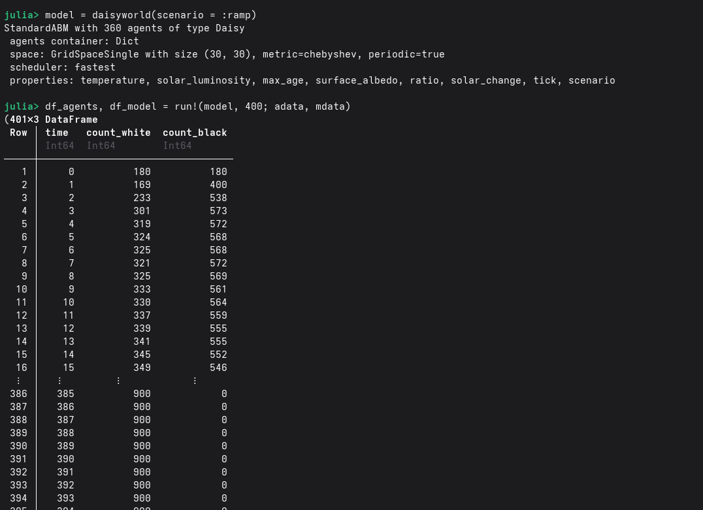{#fig:0012 width=100%}

## Реализация на Agents.jl

- График баланса населении.

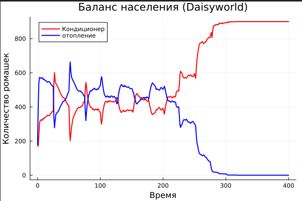{#fig:003 width=100%}

## Базовая визуализация

- Анализ полученной визуализации показывает неоднородное распределение температуры по поверхности модели. Можно заметить корреляцию между плотностью популяции маргариток и локальной температурой: черные маргаритки (с низким альбедо) способствуют поглощению тепла, в то время как белые маргаритки (с высоким альбедо) отражают солнечное излучение. Данная визуализация является отправной точкой для исследования механизмов саморегуляции климата в модели. 

{#fig:004 width=100%}

## Базовая визуализация 

- Визуализация 1: 

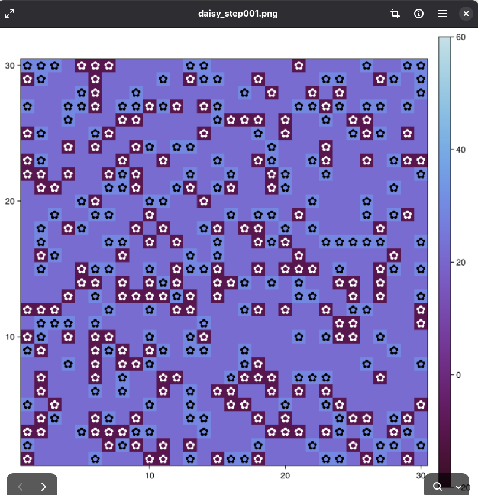{#fig:005 width=100%}

## Базовая визуализация

- Визуализация 2: 

{#fig:006 width=100%}

## Базовая визуализация

- Визуализация 3:  

{#fig:007 width=100%}

## Анимация модели

- Создание файла scripts/daisyworld-animate.jl. 

{#fig:010 width=100%}

## Анимация модели

- Анимация модели позволила выявить фазы экспансии и сокращения популяций в зависимости от локальных температурных условий. На видео четко прослеживается эффект "обратной связи": черные маргаритки начинают доминировать при низких температурах, разогревая поверхность, что создает условия для последующего распространения белых маргариток. Этот динамический процесс является ключевым доказательством устойчивости моделируемой экосистемы.

- Код 

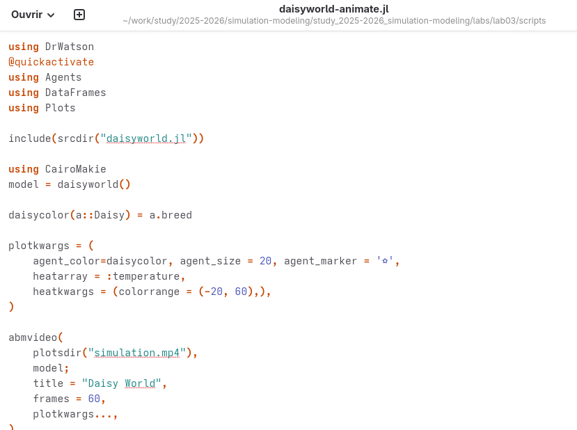{#fig:011 width=100%}

## Динамика числа маргариток

- Построим график изменения числа маргариток в зависимости от модельного
времени 

{#fig:012 width=100%}

## Динамика числа маргариток

- Сгенерирование из литературного кода: jupyter notebook 

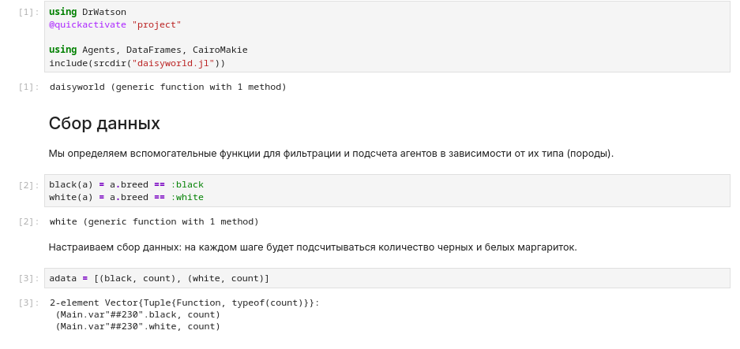{#fig:013 width=100%}

## Динамика числа маргариток

- Таблица 

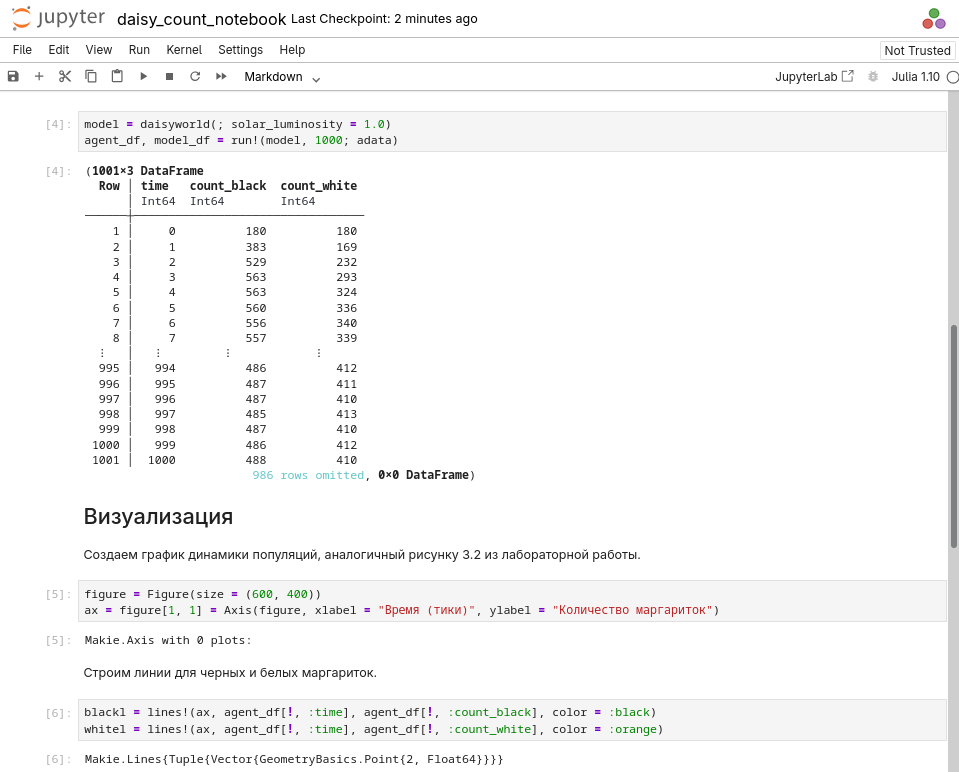{#fig:014 width=100%}

## Динамика числа маргариток

- Визуализации 

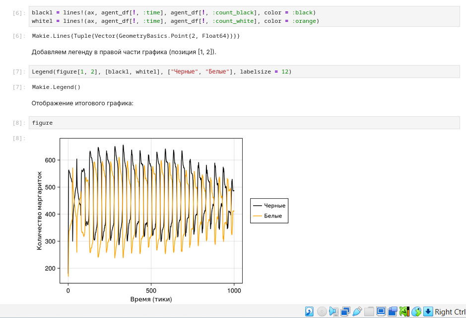{#fig:015 width=100%}

## Динамика модели 

- Построим комплексный график изменения числа маргариток, температуры, аль-
бедо в зависимости от модельного времени 

{#fig:017 width=100%}

## Динамика модели 

- Визуализации в jupyter notebook 

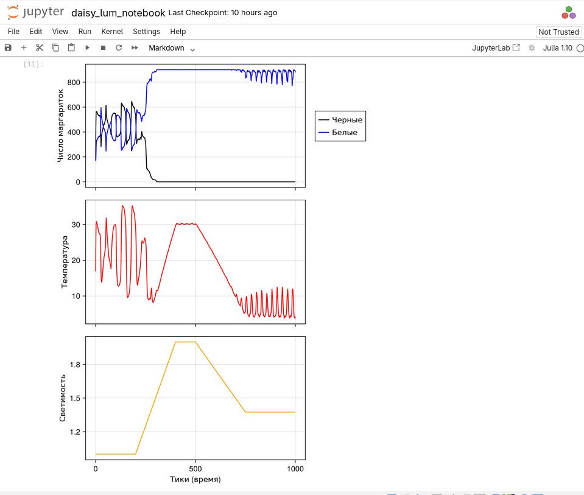{#fig:018 width=100%}

## Базовая визуализация (параметры)

- В данном подразделе реализовано расширение базовой модели за счет введения варьируемых параметров эксперимента. С помощью словаря param_dict определены диапазоны значений для таких характеристик, как максимальный возраст маргариток (max_age) и начальная доля белых маргариток (init_white). Это позволяет автоматизировать процесс проведения серии симуляций (ensemble runs) и в дальнейшем проанализировать, как начальные условия влияют на стабильность климатической системы "Мира маргариток". 

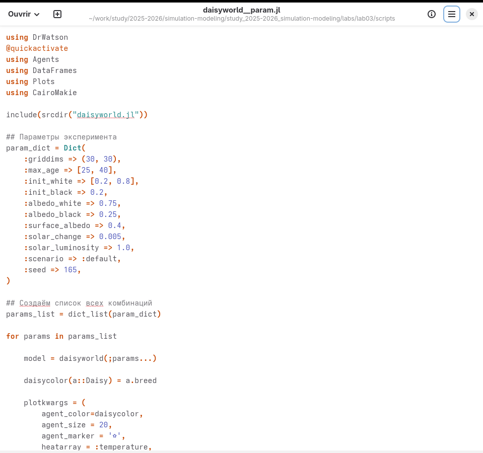{#fig:019 width=100%}

## Базовая визуализация (параметры)

- Визуализации 1 

{#fig:020 width=100%}

## Базовая визуализация (параметры)

- Визуализации 2 

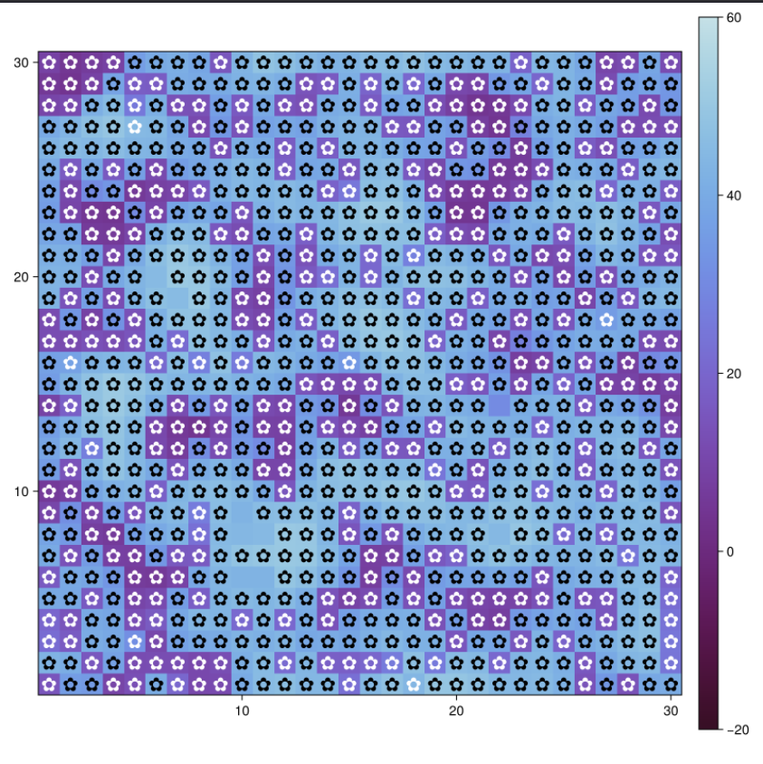{#fig:021 width=100%}

## Базовая визуализация (параметры)

- Визуализации 3

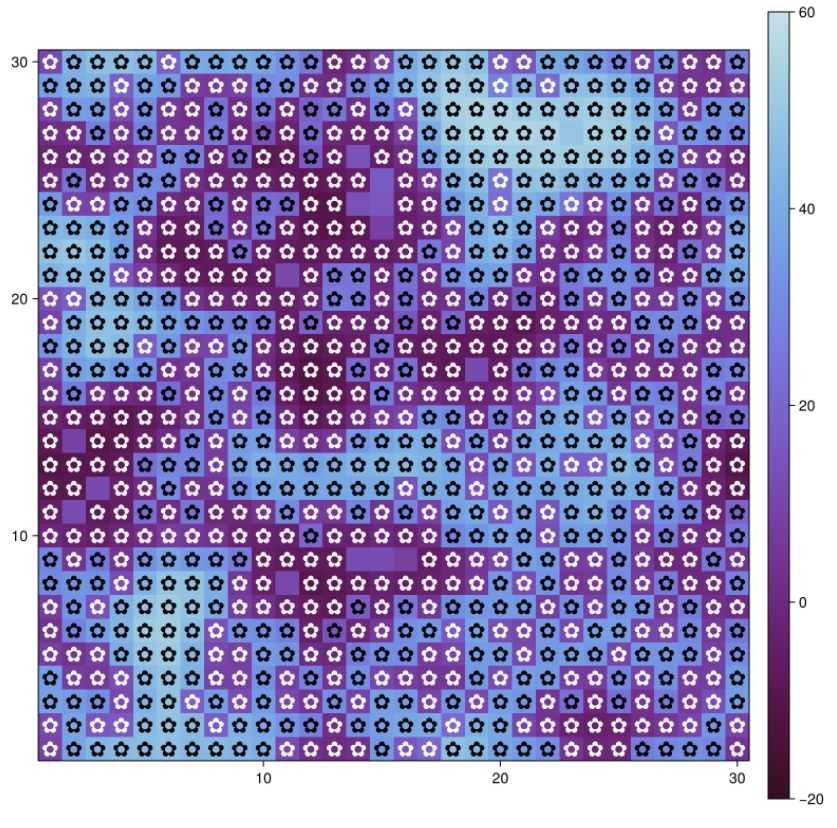{#fig:022 width=100%}

## Динамика числа маргариток (параметры)

- Процесс генерации графиков динамики был полностью автоматизирован в рамках парадигмы литературного программирования. Код из файла scripts/daisyworld-count__param.jl интегрирован в итоговый отчет Quarto, что гарантирует соответствие представленных данных текущим настройкам параметров эксперимента. Такой подход исключает ошибки ручного переноса данных и позволяет быстро пересчитать все результаты при изменении исходных условий в словаре параметров. 

{#fig:023 width=100%}

## Динамика числа маргариток (параметры)

- Визуализации 1 

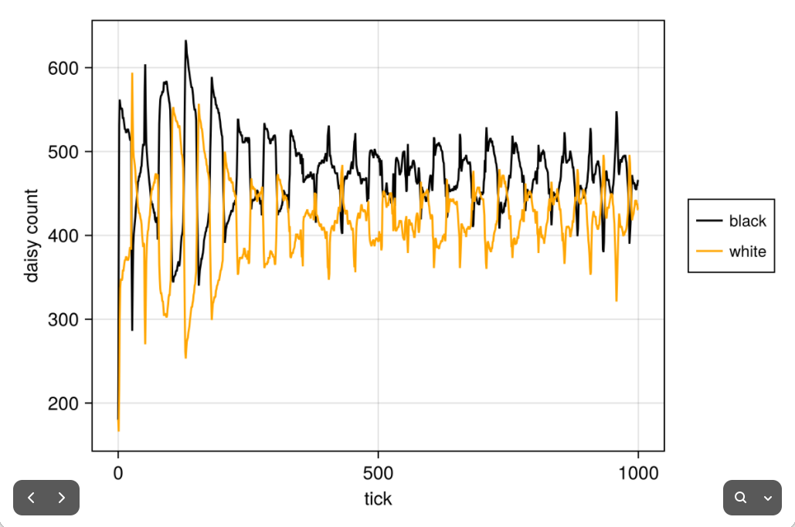{#fig:024 width=100%}

## Динамика числа маргариток (параметры)

- Визуализации 2 

{#fig:025 width=100%}

## Динамика числа маргариток (параметры)

- Визуализации 3

{#fig:026 width=100%}

## Динамика числа маргариток (параметры)

- Визуализации 4

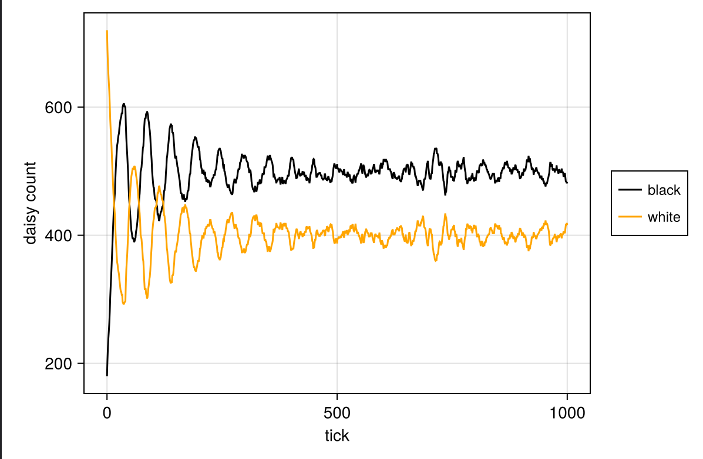{#fig:027 width=100%}

## Динамика модели (параметры)

- Построим комплексный график изменения числа маргариток, температуры, альбедо в зависимости от модельного времени с разными параметрами модели.

{#fig:028 width=100%}

## Динамика модели (параметры)

- Визуализации 1

{#fig:029 width=100%}

## Динамика модели (параметры)

- Визуализации 2

{#fig:030 width=100%}

## Динамика модели (параметры)

- Визуализации 3 

{#fig:031 width=100%}

## Выводы

- Я выполнила лабораторную работу.

