---
## Front matter
title: "Лабораторная работа №3"
subtitle: "Агентное моделирование."
author: "Разанацуа Сара Естэлл"

## Generic otions
lang: ru-RU
toc-title: "Содержание"

## Bibliography
bibliography: bib/cite.bib
csl: pandoc/csl/gost-r-7-0-5-2008-numeric.csl

## Pdf output format
toc: true # Table of contents
toc-depth: 2
lof: true # List of figures
lot: true # List of tables
fontsize: 12pt
linestretch: 1.5
papersize: a4
documentclass: scrreprt
## I18n polyglossia
polyglossia-lang:
  name: russian
  options:
	- spelling=modern
	- babelshorthands=true
polyglossia-otherlangs:
  name: english
## I18n babel
babel-lang: russian
babel-otherlangs: english
## Fonts
mainfont: PT Serif
romanfont: PT Serif
sansfont: PT Sans
monofont: PT Mono
mainfontoptions: Ligatures=TeX
romanfontoptions: Ligatures=TeX
sansfontoptions: Ligatures=TeX,Scale=MatchLowercase
monofontoptions: Scale=MatchLowercase,Scale=0.9
## Biblatex
biblatex: true
biblio-style: "gost-numeric"
biblatexoptions:
  - parentracker=true
  - backend=biber
  - hyperref=auto
  - language=auto
  - autolang=other*
  - citestyle=gost-numeric
## Pandoc-crossref LaTeX customization
figureTitle: "Рис."
tableTitle: "Таблица"
listingTitle: "Листинг"
lofTitle: "Список иллюстраций"
lotTitle: "Список таблиц"
lolTitle: "Листинги"
## Misc options
indent: true
header-includes:
  - \usepackage{indentfirst}
  - \usepackage{float} # keep figures where there are in the text
  - \floatplacement{figure}{H} # keep figures where there are in the text
---

# Цель работы

- Агентный подход к имитационному моделированию (Agent-Based Modeling, ABM) — это метод исследования сложных систем, в котором поведение системы возникает из взаимодействия множества автономных сущностей, называемых агентами. Вместо того чтобы описывать систему глобальными уравнениями, мы моделируем каждую индивидуальную единицу и правила её поведения, а затем наблюдаем, какие коллективные паттерны появляются снизу вверх. Этот подход особенно полезен, когда поведение системы трудно предсказать из-за нелинейностей, гетерогенности участников или адаптивных стратегий.

# Задание

1. Создать рабочий каталог для кода.
2. Установить необходимые пакеты.
3. Выполнить предложенный код.
4. Преобразовать код в литературный стиль.
5. Сгенерировать из литературного кода:
- чистый код;
- jupyter notebook;
- документацию в формате Quarto.
6. Выполнить код из jupyter notebook.
7. Интегрировать документацию в формате Quarto в отчёт.
8. Добавить в код в литературном стиле вычисление для набора параметров.
9. Сгенерировать из литературного кода с параметрами:
- чистый код;
- jupyter notebook;
- документацию в формате Quarto.
10. Выполнить код из jupyter notebook с параметрами.
11. Интегрировать документацию с параметрами в формате Quarto в отчёт.
- Результирующие файлы не удаляйте, выложите на git.

# Выполнение лабораторной работы

## Реализация на Agents.jl

- Мы создадим файл src/daisyworld.jl. Здесь мы определим тип агента и функции шага модели.

(рис. [-@fig:001]).

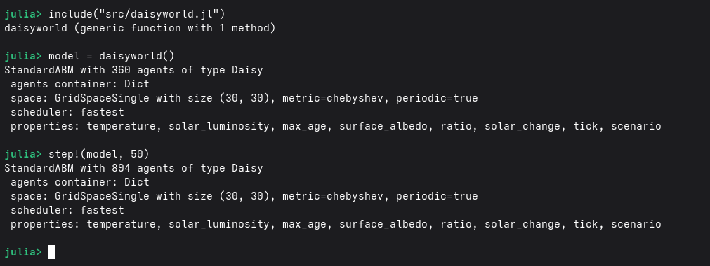{#fig:001 width=100%}

- Таблица, которая мы получили. (рис. [-@fig:002]).

{#fig:0012 width=100%}

- График баланса населении. (рис. [-@fig:003]).

{#fig:003 width=100%}

## Базовая визуализация

- Анализ полученной визуализации показывает неоднородное распределение температуры по поверхности модели. Можно заметить корреляцию между плотностью популяции маргариток и локальной температурой: черные маргаритки (с низким альбедо) способствуют поглощению тепла, в то время как белые маргаритки (с высоким альбедо) отражают солнечное излучение. Данная визуализация является отправной точкой для исследования механизмов саморегуляции климата в модели. (рис. [-@fig:004]).

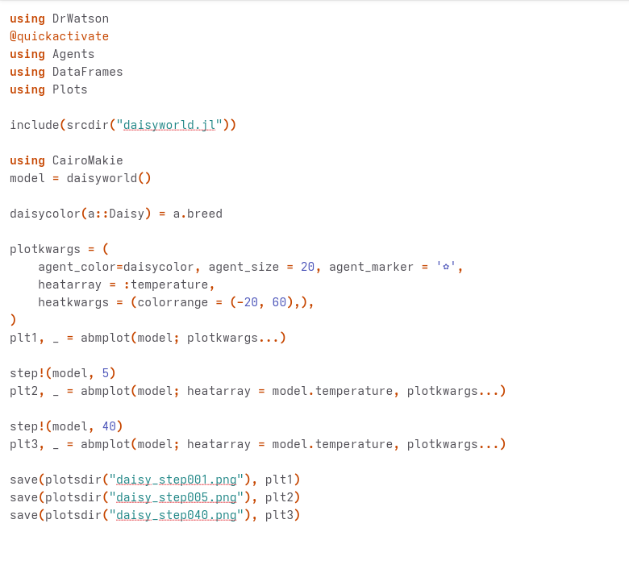{#fig:004 width=100%}

- Визуализация 1: (рис. [-@fig:005]).

{#fig:005 width=100%}

- Визуализация 2: (рис. [-@fig:006]).

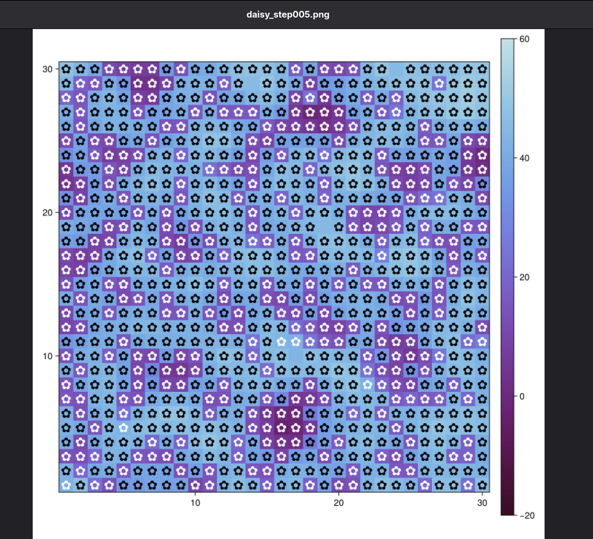{#fig:006 width=100%}

- Визуализация 3:  (рис. [-@fig:007]).

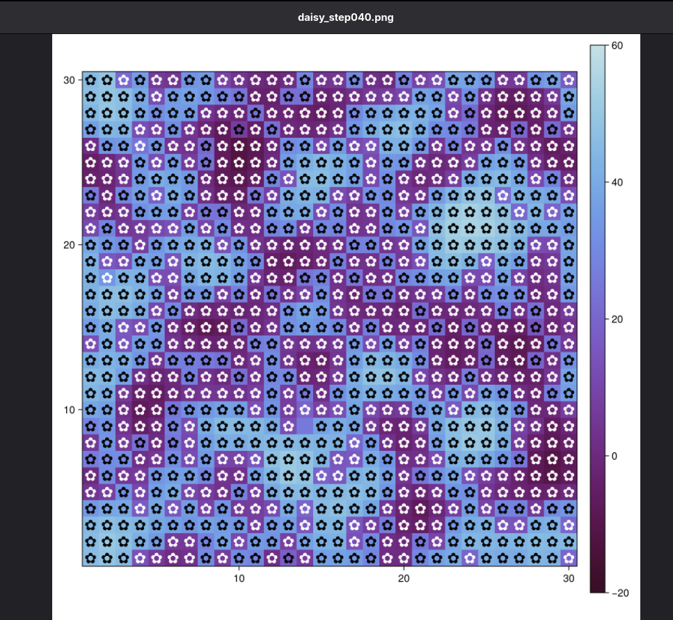{#fig:007 width=100%}

- Сгенерирование из литературного кода:
- чистый код;
- jupyter notebook;
- документацию в формате Quarto. (рис. [-@fig:008]).

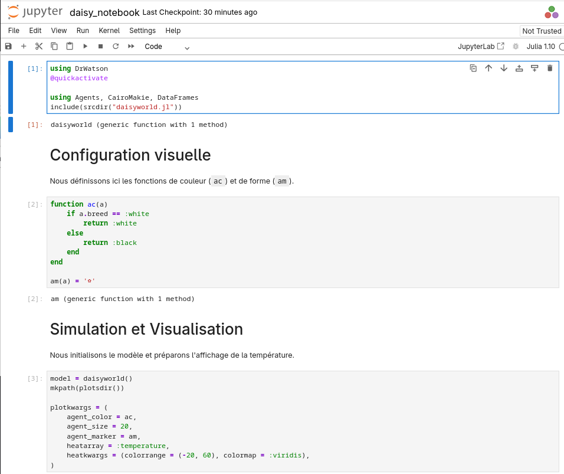{#fig:008 width=100%}

- Визуализация (рис. [-@fig:009]).

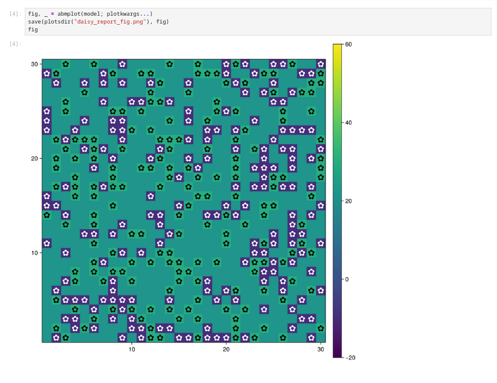{#fig:009 width=100%}

## Анимация модели

- Создание файла scripts/daisyworld-animate.jl. (рис. [-@fig:010]).

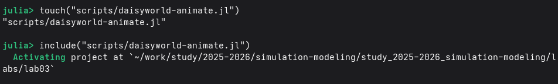{#fig:010 width=100%}

- Анимация модели позволила выявить фазы экспансии и сокращения популяций в зависимости от локальных температурных условий. На видео четко прослеживается эффект "обратной связи": черные маргаритки начинают доминировать при низких температурах, разогревая поверхность, что создает условия для последующего распространения белых маргариток. Этот динамический процесс является ключевым доказательством устойчивости моделируемой экосистемы.

- Код (рис. [-@fig:011]).

{#fig:011 width=100%}

## Динамика числа маргариток

- Построим график изменения числа маргариток в зависимости от модельного
времени (рис. [-@fig:012]).

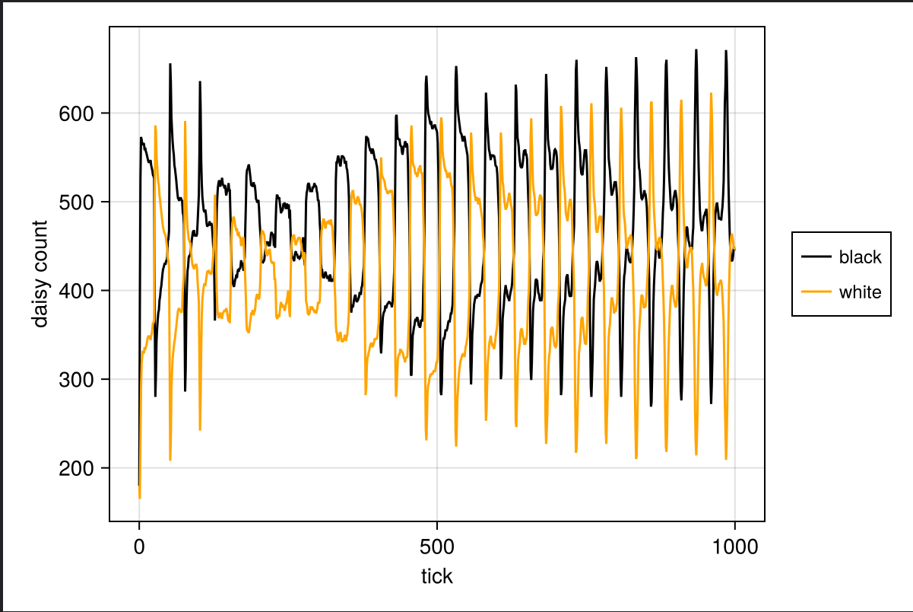{#fig:012 width=100%}

- Сгенерирование из литературного кода:
- чистый код;
- jupyter notebook;
- документацию в формате Quarto. (рис. [-@fig:013]).

{#fig:013 width=100%}

- Таблица (рис. [-@fig:014]).

{#fig:014 width=100%}

- Визуализации (рис. [-@fig:015]).

{#fig:015 width=100%}

## Динамика модели 

- Построим комплексный график изменения числа маргариток, температуры, аль-
бедо в зависимости от модельного времени (рис. [-@fig:017]).

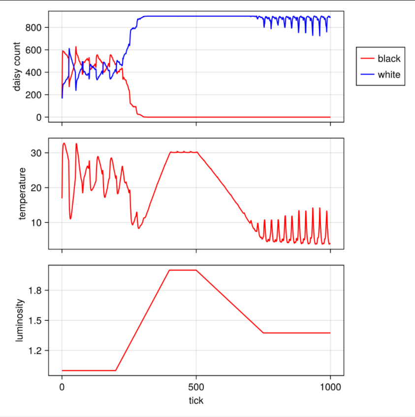{#fig:017 width=100%}

- Визуализации в jupyter notebook (рис. [-@fig:018]).

{#fig:018 width=100%}

## Базовая визуализация (параметры)

- В данном подразделе реализовано расширение базовой модели за счет введения варьируемых параметров эксперимента. С помощью словаря param_dict определены диапазоны значений для таких характеристик, как максимальный возраст маргариток (max_age) и начальная доля белых маргариток (init_white). Это позволяет автоматизировать процесс проведения серии симуляций (ensemble runs) и в дальнейшем проанализировать, как начальные условия влияют на стабильность климатической системы "Мира маргариток". (рис. [-@fig:019]).

{#fig:019 width=100%}

- Визуализации 1 (рис. [-@fig:020]).

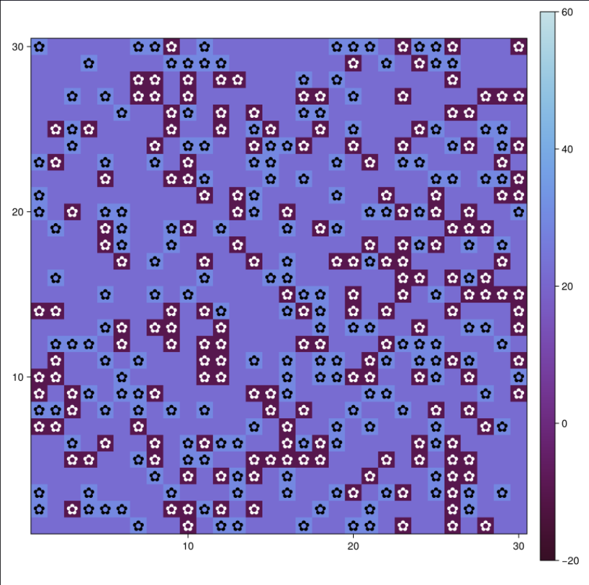{#fig:020 width=100%}

- Визуализации 2 (рис. [-@fig:021]).

{#fig:021 width=100%}

- Визуализации 3 (рис. [-@fig:022]).

{#fig:022 width=100%}

## Динамика числа маргариток (параметры)

- Процесс генерации графиков динамики был полностью автоматизирован в рамках парадигмы литературного программирования. Код из файла scripts/daisyworld-count__param.jl интегрирован в итоговый отчет Quarto, что гарантирует соответствие представленных данных текущим настройкам параметров эксперимента. Такой подход исключает ошибки ручного переноса данных и позволяет быстро пересчитать все результаты при изменении исходных условий в словаре параметров. (рис. [-@fig:023]).

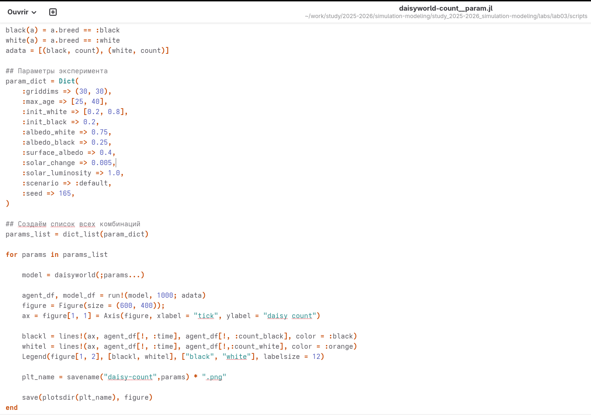{#fig:023 width=100%}

- Визуализации 1 (рис. [-@fig:024]).

{#fig:024 width=100%}

- Визуализации 2 (рис. [-@fig:025]).

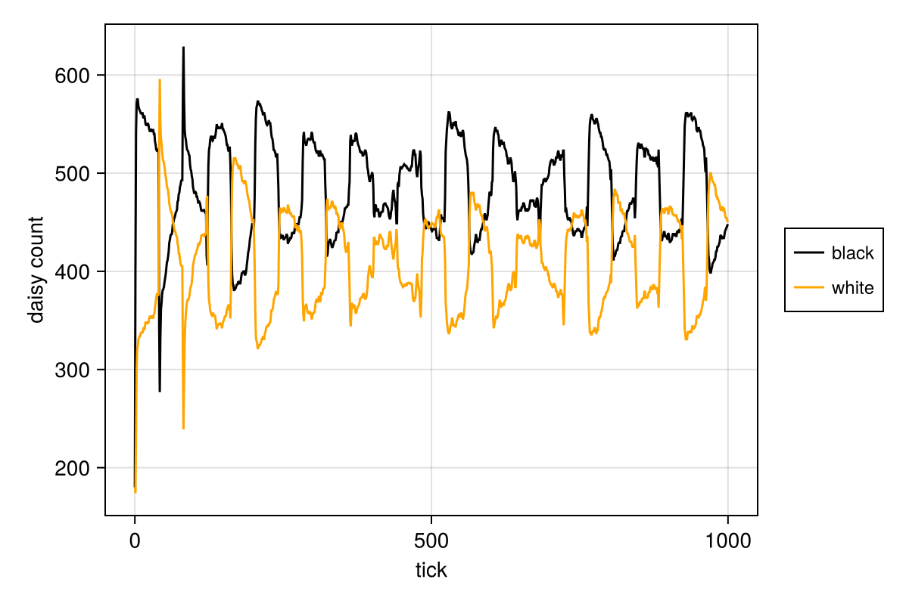{#fig:025 width=100%}

- Визуализации 3 (рис. [-@fig:026]).

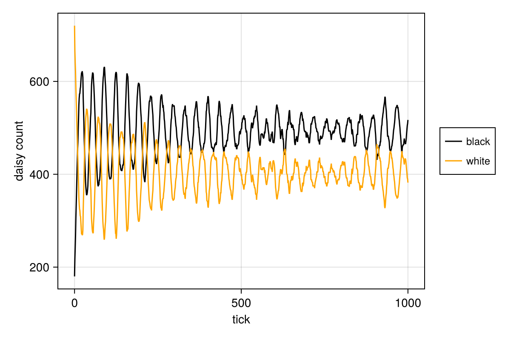{#fig:026 width=100%}

- Визуализации 4 (рис. [-@fig:027]).

{#fig:027 width=100%}

## Динамика модели (параметры)

- Построим комплексный график изменения числа маргариток, температуры, альбедо в зависимости от модельного времени с разными параметрами модели. (рис. [-@fig:028]).

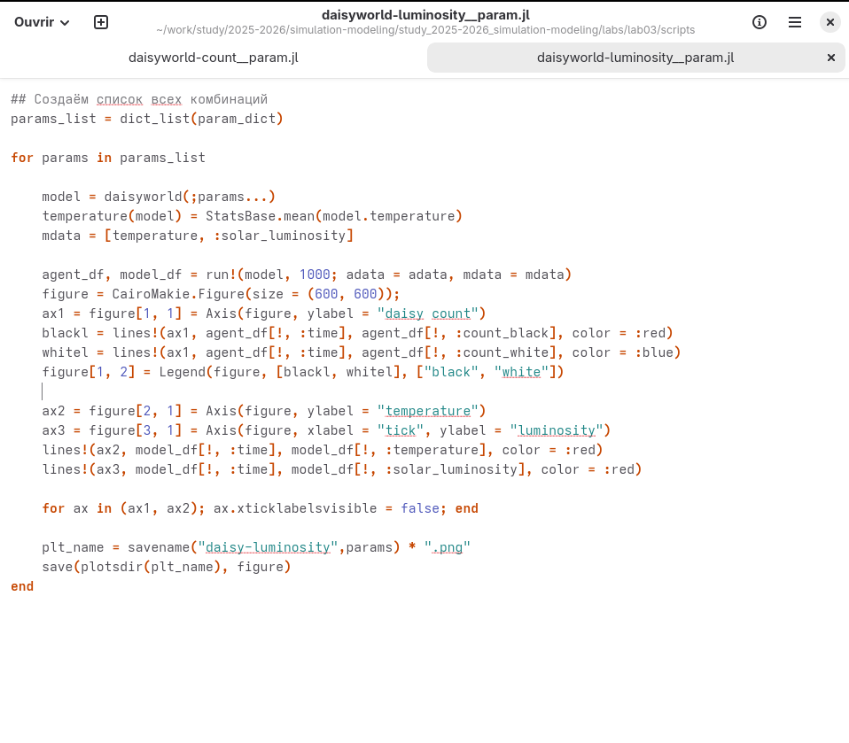{#fig:028 width=100%}

- Визуализации 1 (рис. [-@fig:029]).

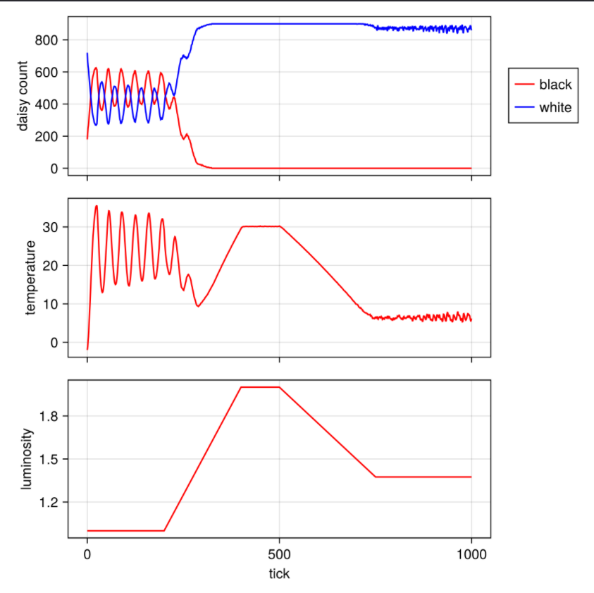{#fig:029 width=100%}

- Визуализации 2 (рис. [-@fig:030]).

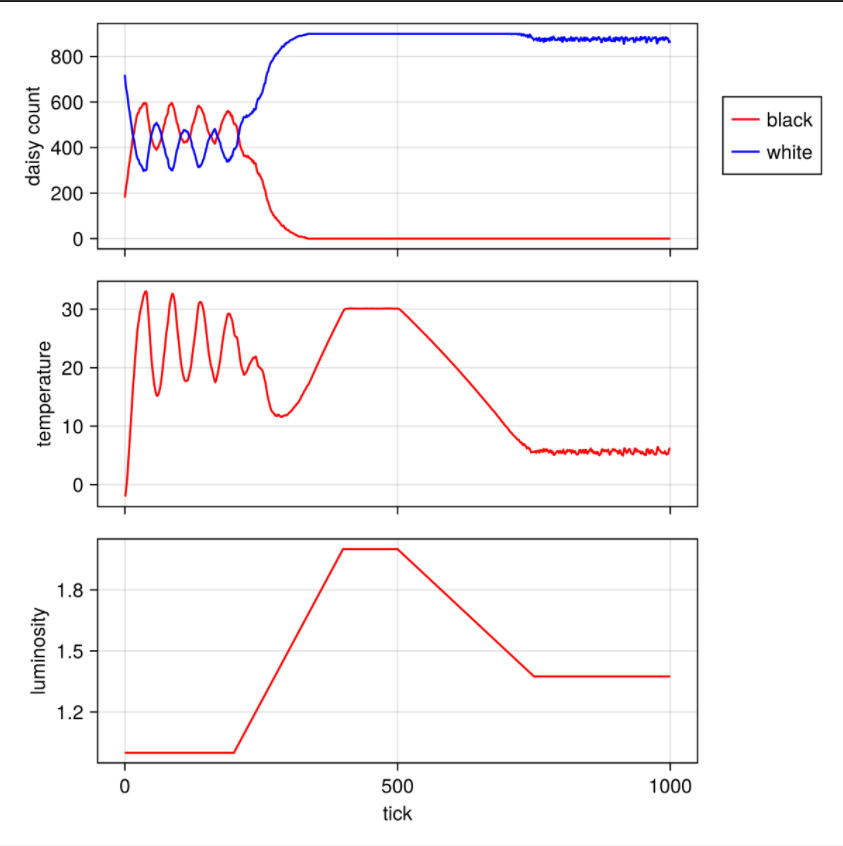{#fig:030 width=100%}

- Визуализации 3 (рис. [-@fig:031]).

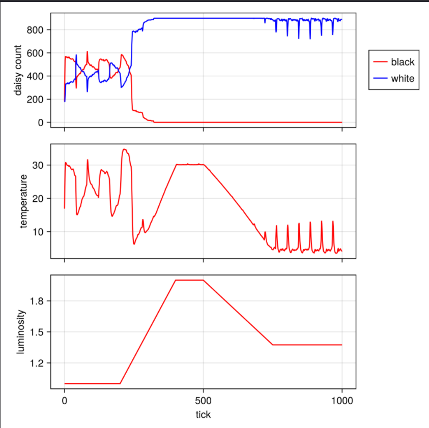{#fig:031 width=100%}

# Выводы

- Я выполнила лабораторную работу.

# Список литературы{.unnumbered}

::: {#refs}
:::
