---
## Front matter
title: "Лабораторная работа №4"
subtitle: "Реализация основных моделей в агентном подходе"
author: "Разанацуа Сара Естэлл"

## Generic otions
lang: ru-RU
toc-title: "Содержание"

## Bibliography
bibliography: bib/cite.bib
csl: pandoc/csl/gost-r-7-0-5-2008-numeric.csl

## Pdf output format
toc: true # Table of contents
toc-depth: 2
lof: true # List of figures
lot: true # List of tables
fontsize: 12pt
linestretch: 1.5
papersize: a4
documentclass: scrreprt
## I18n polyglossia
polyglossia-lang:
  name: russian
  options:
	- spelling=modern
	- babelshorthands=true
polyglossia-otherlangs:
  name: english
## I18n babel
babel-lang: russian
babel-otherlangs: english
## Fonts
mainfont: PT Serif
romanfont: PT Serif
sansfont: PT Sans
monofont: PT Mono
mainfontoptions: Ligatures=TeX
romanfontoptions: Ligatures=TeX
sansfontoptions: Ligatures=TeX,Scale=MatchLowercase
monofontoptions: Scale=MatchLowercase,Scale=0.9
## Biblatex
biblatex: true
biblio-style: "gost-numeric"
biblatexoptions:
  - parentracker=true
  - backend=biber
  - hyperref=auto
  - language=auto
  - autolang=other*
  - citestyle=gost-numeric
## Pandoc-crossref LaTeX customization
figureTitle: "Рис."
tableTitle: "Таблица"
listingTitle: "Листинг"
lofTitle: "Список иллюстраций"
lotTitle: "Список таблиц"
lolTitle: "Листинги"
## Misc options
indent: true
header-includes:
  - \usepackage{indentfirst}
  - \usepackage{float} # keep figures where there are in the text
  - \floatplacement{figure}{H} # keep figures where there are in the text
---

# Цель работы

Создадим агентную модель распространения инфекционного заболевания на основе классической компартментальной модели SIR (Susceptible-InfectiousRecovered). Модель будет реализована с использованием пакета Agents.jl. В отличие от классической модели на дифференциальных уравнениях, агентный подход позволит учесть индивидуальные характеристики, пространственную структуру и стохастичность процессов.

# Задание

1. Создать рабочий каталог для кода.
2. Установить необходимые пакеты.
3. Выполнить предложенный код.
4. Преобразовать код в литературный стиль.
5. Сгенерировать из литературного кода:
- чистый код;
- jupyter notebook;
- документацию в формате Quarto.
6. Выполнить код из jupyter notebook.
7. Интегрировать документацию в формате Quarto в отчёт.
8. Добавить в код в литературном стиле вычисление для набора параметров.
9. Сгенерировать из литературного кода с параметрами:
- чистый код;
- jupyter notebook;
- документацию в формате Quarto.
10. Выполнить код из jupyter notebook с параметрами.
11. Интегрировать документацию с параметрами в формате Quarto в отчёт.
- Результирующие файлы не удаляйте, выложите на git.

# Выполнение лабораторной работы

## Эпидемиологическая модели SIR

- Мы создадим файл src/sir_model.jl. и запустим его. (рис. [-@fig:001]).

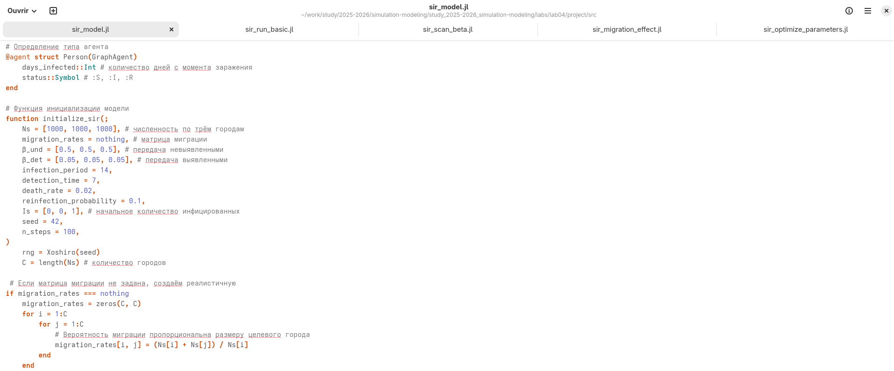{#fig:001 width=100%}

- Вывод в консоль. (рис. [-@fig:002]).

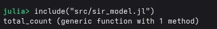{#fig:002 width=100%}

## Базовый эксперимент

- Запускаем один эксперимент с фиксированными параметрами (по умолчанию) и
сохраняем динамику численности агентов. Это служит для проверки работоспособности модели и получения базового понимания эпидемического процесса. (рис. [-@fig:003]).

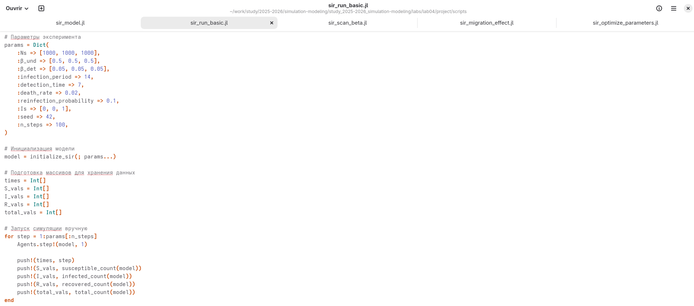{#fig:003 width=100%}

- Мы создадим файл src/sir_run_basic.jl и запустим его. (рис. [-@fig:004]).

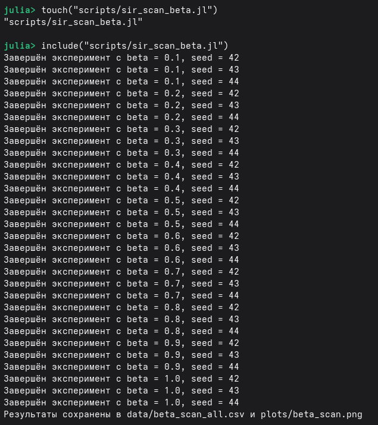{#fig:004 width=100%}

- График: plots/sir_basic_dynamics.png — четыре линии: S(t), I(t), R(t) и общая
численность. Позволяет визуально оценить пик эпидемии,
скорость распространения и влияние смертности.  (рис. [-@fig:005]).

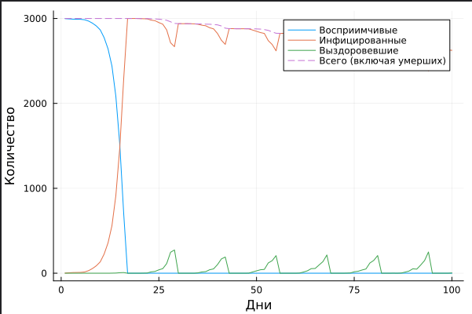{#fig:005 width=100%}

## Сканирование коэффициента заразности

- Исследуем, как изменение базовой заразности (β_und и пропорционально β_det) влияет на эпидемические показатели: пик заболеваемости, долю переболевших, число умерших. Выполняется параметрическое сканирование с несколькими повторными прогонами для учёта стохастичности. (рис. [-@fig:006]).

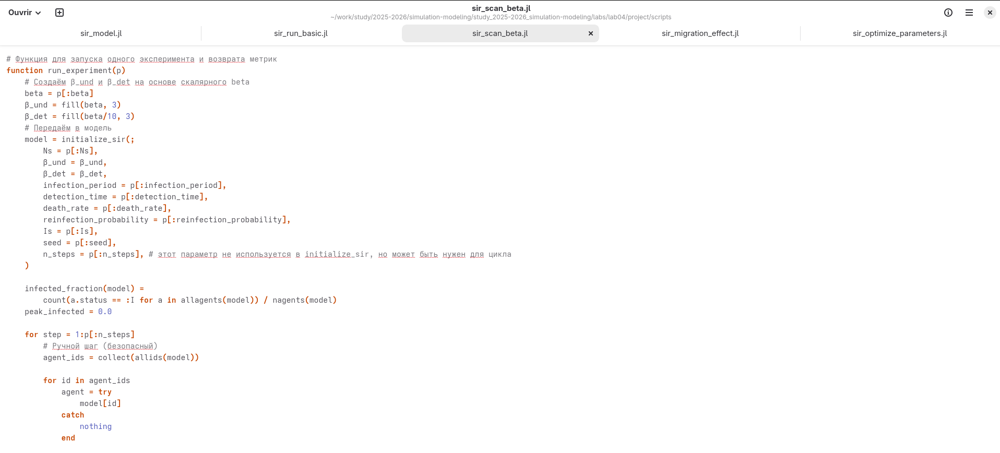{#fig:006 width=100%}

- Создание файла scripts/sir_scan_beta.jl и запустим его. (рис. [-@fig:007]).

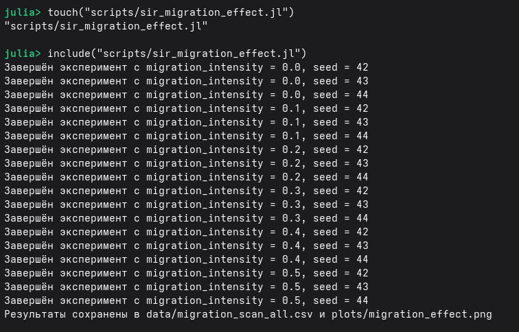{#fig:007 width=100%}

- График позволяет найти пороговое значение 𝛽, при котором возникает эпидемия,
и оценить, как увеличивается нагрузка на систему с ростом заразности (рис. [-@fig:008]).

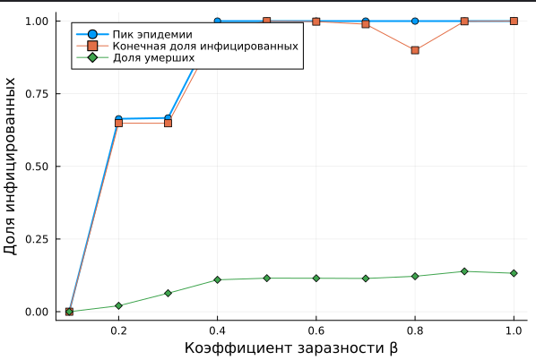{#fig:008 width=100%}

## Исследование эффекта миграции

- Исследует, как интенсивность перемещения людей между городами влияет на скорость распространения эпидемии (время достижения пика) и масштаб пика. Инфекция начинается только в одном городе, остальные изначально здоровы. (рис. [-@fig:009]).

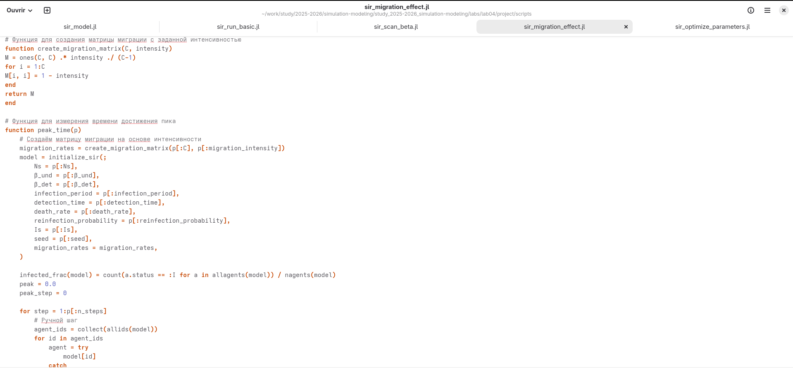{#fig:009 width=100%}

- График демонстрирует, как ускорение обмена людьми между городами приводит к более раннему и более высокому пику эпидемии (рис. [-@fig:011]).

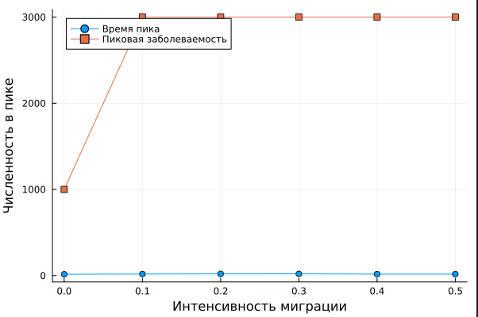{#fig:011 width=100%}

## Многокритериальная оптимизация параметров

- Ищим оптимальные комбинации параметров, минимизирующие одновременно
два критерия: пиковую заболеваемость и долю умерших. Используем эволюционный алгоритм (Borg MOEA) из пакета BlackBoxOptim. (рис. [-@fig:012]).

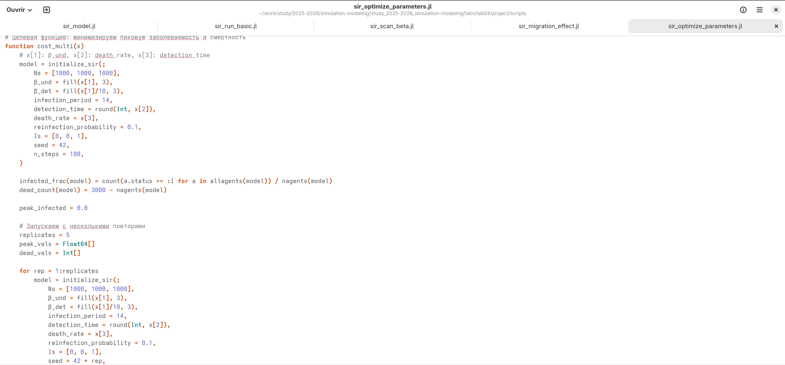{#fig:012 width=100%}

- Создание файла scripts/sir_optimize_parameters.jl и запустим его. (рис. [-@fig:010]).

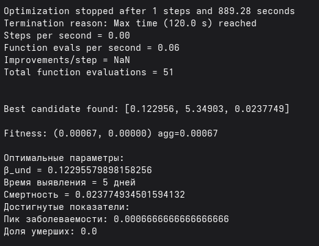{#fig:010 width=100%}

- Вывод в консоль: оптимальные параметры и соответствующие им значения
критериев.

## Сводная визуализация результатов

- Этот скрипт загружает результаты параметрического сканирования (файл data/beta_scan_all.csv, созданный scan_beta.jl) и строит единый составной график, объединяющий три панели:

— пик эпидемии и конечная доля инфицированных;
— число умерших;
— доля выздоровевших.

График сохраняется как plots/comprehensive_analysis.png. Скрипт предназначен для итогового отчёта и не требует повторного запуска симуляций. (рис. [-@fig:013]).

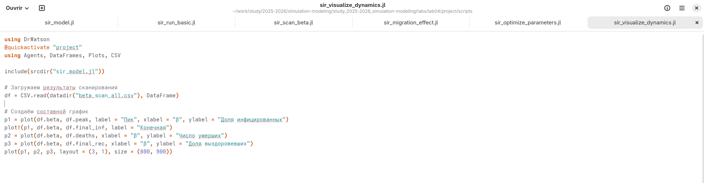{#fig:013 width=100%}

- График: plots/comprehensive_analysis.png (рис. 4.4). Три панели, позволяющие одновременно оценить:

— порог возникновения эпидемии (рост пика);
— нелинейное увеличение смертности;
— насыщение доли переболевших.

- В консоль может выводиться дополнительная статистика (например, значения β, при которых пик превышает 5%). (рис. [-@fig:014]).

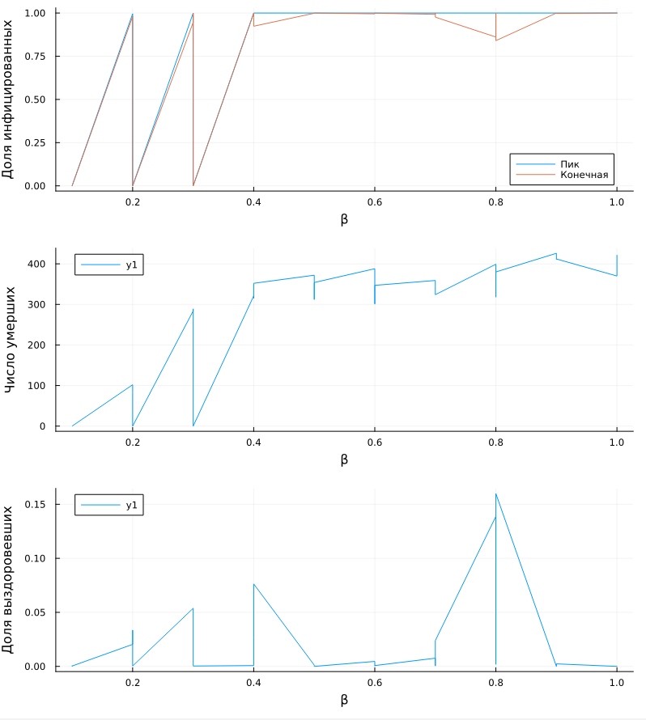{#fig:014 width=100%}

# Выводы

- Я выполнила лабораторную работу.

# Список литературы{.unnumbered}

::: {#refs}
:::
