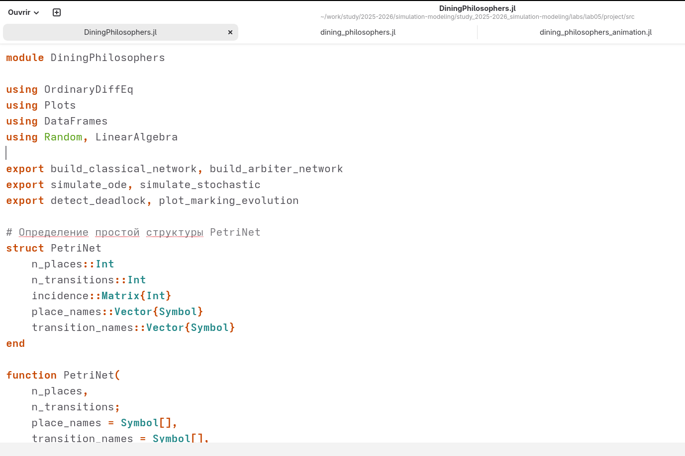
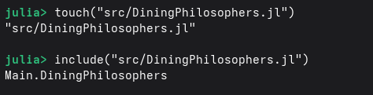
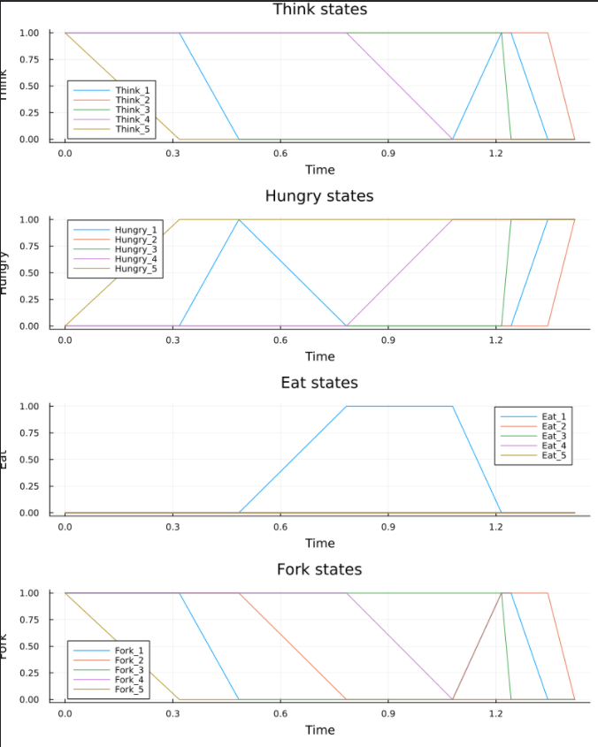
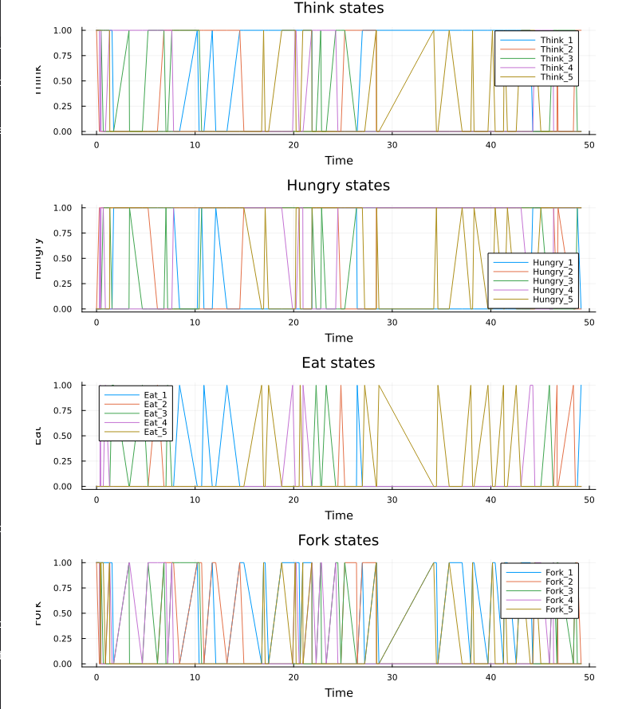
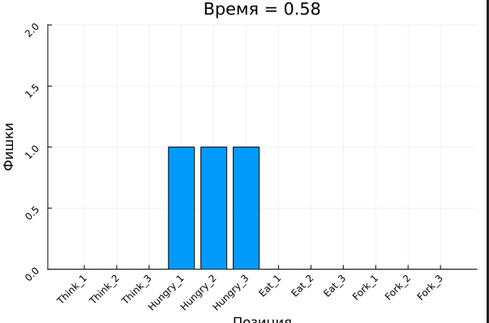
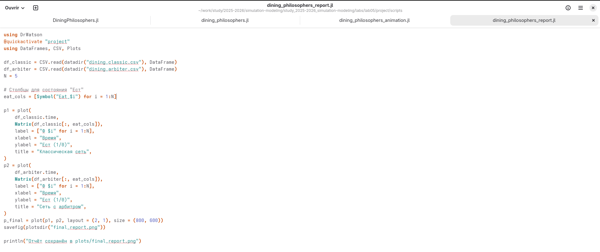
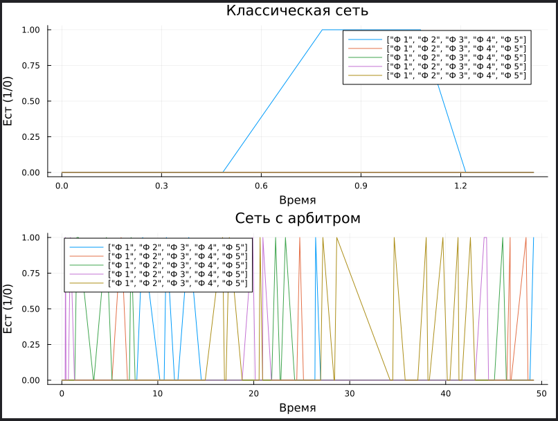

---
## Front matter
lang: ru-RU
title: Лабораторная работа №5
subtitle: Аппарат сетей Петри
author:
  - Разанацуа Сара Естэлл
institute:
  - Российский университет дружбы народов, Москва, Россия
## i18n babel
babel-lang: russian
babel-otherlangs: english

## Formatting pdf
toc: false
toc-title: Содержание
slide_level: 2
aspectratio: 169
section-titles: true
theme: metropolis
header-includes:
 - \metroset{progressbar=frametitle,sectionpage=progressbar,numbering=fraction}
 - '\makeatletter'
 - '\beamer@ignorenonframefalse'
 - '\makeatother'
---
:::
::::::::::::::

## Цель работы

- Построим сеть Петри для пяти философов, моделируя захват и освобождение вилок. Обнаружим состояние взаимной блокировки (deadlock), когда каждый философ взял одну вилку и ждёт вторую. Провести имитационное моделирование (стохастическое и детерминированное) и выявить наличие deadlock. Модифицировать сеть, чтобы предотвратить deadlock. Проанализировать результаты и оформить отчёт с графиками и анимацией.

## Задание

1. Создать рабочий каталог для кода.
2. Установить необходимые пакеты.
3. Выполнить предложенный код.
4. Преобразовать код в литературный стиль.
5. Сгенерировать из литературного кода:
- чистый код;
- jupyter notebook;
- документацию в формате Quarto.
6. Выполнить код из jupyter notebook.
7. Интегрировать документацию в формате Quarto в отчёт.
8. Добавить в код в литературном стиле вычисление для набора параметров.
9. Сгенерировать из литературного кода с параметрами:
- чистый код;
- jupyter notebook;
- документацию в формате Quarto.
10. Выполнить код из jupyter notebook с параметрами.
11. Интегрировать документацию с параметрами в формате Quarto в отчёт.
- Результирующие файлы не удаляйте, выложите на git.

# Выполнение лабораторной работы

## Обедающие философы

- Мы создадим файл src/DiningPhilosophers.jl и запустим его. 

{#fig:001 width=70%}

## Обедающие философы

- Вывод в консоль. 

{#fig:002 width=70%}

## Базовый эксперимент

- Скрипт выполняет основное моделирование и сравнение двух вариантов сети Петри:
1. классическая модель (без арбитра), в которой возможна взаимная блокировка (deadlock);
2. модифицированная модель с арбитром, которая должна предотвращать deadlock. 

{#fig:003 width=70%}

## Базовый эксперимент

- Создание файла scripts/dining_philosophers.jl и запустим его. 

{#fig:004 width=70%}

## Базовый эксперимент

- Графики эволюции маркировки позволяют визуально увидеть, как меняются состояния.

1. В классической сети рано или поздно все Eat_i становятся нулевыми, а Hungry_i – единичными (или наоборот).

{#fig:005 width=70%}

## Базовый эксперимент

2. В сети с арбитром наблюдается постоянное чередование приёма пищи.

{#fig:006 width=70%}

## Анимация процесса

- Для наглядной демонстрации динамики работы сети Петри во времени.
- Анимация позволяет увидеть, как меняется маркировка (фишки) в каждой позиции, и особенно наглядно показывает возникновение deadlock в классической модели.

{#fig:007 width=70%}

## Анимация процесса

- Анимация делает абстрактные состояния сети Петри живыми.

- Видно, как фишки перемещаются между позициями: философы переходят из Think в Hungry, затем в Eat и обратно. 

{#fig:008 width=70%}

## Итоговый отчёт

- Для сравнительного анализа двух моделей (с арбитром и без) по одному ключевому показателю — числу философов, находящихся в состоянии «Ест» (Eat_i).

- Скрипт генерирует сводный график.

{#fig:009 width=70%}

## Итоговый отчёт

1. Классическая сеть: на графике видно, что через некоторое время все линии Eat_i падают до нуля и остаются на нуле
- Это и есть deadlock.
- Философы больше не могут есть.

## Итоговый отчёт

2. Сеть с арбитром: линии Eat_i колеблются, всегда есть хотя бы один философ, который ест (или они поочерёдно получают доступ).
- Отсутствие длительных нулевых периодов подтверждает, что система жива и не блокируется. 

{#fig:010 width=70%}

## Выводы

- Я выполнила лабораторную работу.

