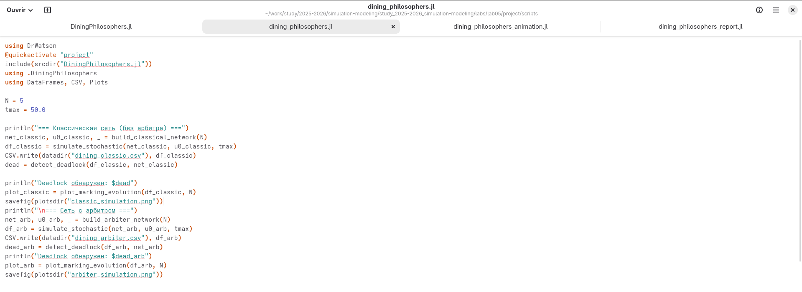
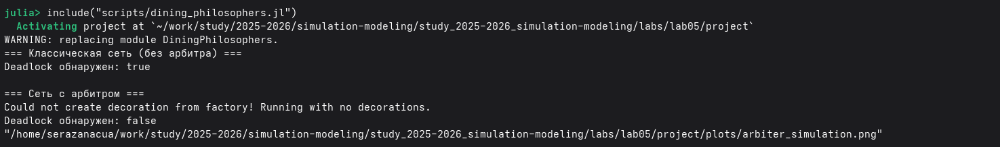
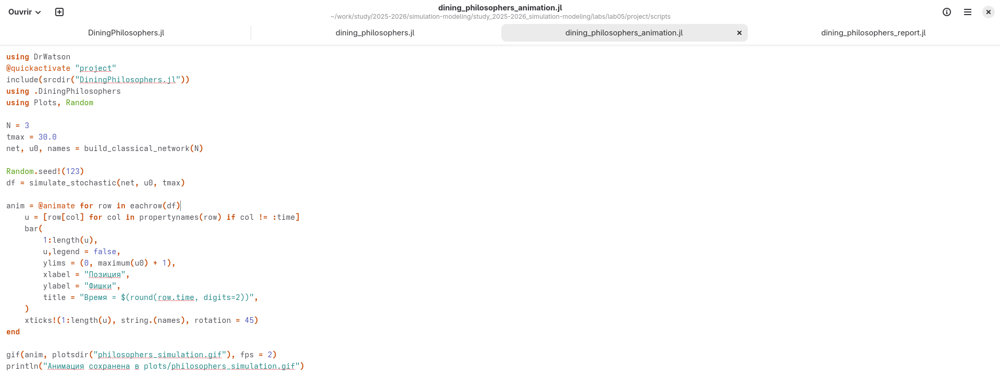

---
## Front matter
title: "Лабораторная работа №5"
subtitle: "Аппарат сетей Петри"
author: "Разанацуа Сара Естэлл"

## Generic otions
lang: ru-RU
toc-title: "Содержание"

## Bibliography
bibliography: bib/cite.bib
csl: pandoc/csl/gost-r-7-0-5-2008-numeric.csl

## Pdf output format
toc: true # Table of contents
toc-depth: 2
lof: true # List of figures
lot: true # List of tables
fontsize: 12pt
linestretch: 1.5
papersize: a4
documentclass: scrreprt
## I18n polyglossia
polyglossia-lang:
  name: russian
  options:
	- spelling=modern
	- babelshorthands=true
polyglossia-otherlangs:
  name: english
## I18n babel
babel-lang: russian
babel-otherlangs: english
## Fonts
mainfont: PT Serif
romanfont: PT Serif
sansfont: PT Sans
monofont: PT Mono
mainfontoptions: Ligatures=TeX
romanfontoptions: Ligatures=TeX
sansfontoptions: Ligatures=TeX,Scale=MatchLowercase
monofontoptions: Scale=MatchLowercase,Scale=0.9
## Biblatex
biblatex: true
biblio-style: "gost-numeric"
biblatexoptions:
  - parentracker=true
  - backend=biber
  - hyperref=auto
  - language=auto
  - autolang=other*
  - citestyle=gost-numeric
## Pandoc-crossref LaTeX customization
figureTitle: "Рис."
tableTitle: "Таблица"
listingTitle: "Листинг"
lofTitle: "Список иллюстраций"
lotTitle: "Список таблиц"
lolTitle: "Листинги"
## Misc options
indent: true
header-includes:
  - \usepackage{indentfirst}
  - \usepackage{float} # keep figures where there are in the text
  - \floatplacement{figure}{H} # keep figures where there are in the text
---

# Цель работы

- Построим сеть Петри для пяти философов, моделируя захват и освобождение вилок. Обнаружим состояние взаимной блокировки (deadlock), когда каждый философ взял одну вилку и ждёт вторую. Провести имитационное моделирование (стохастическое и детерминированное) и выявить наличие deadlock. Модифицировать сеть, чтобы предотвратить deadlock. Проанализировать результаты и оформить отчёт с графиками и анимацией.

# Задание

1. Создать рабочий каталог для кода.
2. Установить необходимые пакеты.
3. Выполнить предложенный код.
4. Преобразовать код в литературный стиль.
5. Сгенерировать из литературного кода:
- чистый код;
- jupyter notebook;
- документацию в формате Quarto.
6. Выполнить код из jupyter notebook.
7. Интегрировать документацию в формате Quarto в отчёт.
8. Добавить в код в литературном стиле вычисление для набора параметров.
9. Сгенерировать из литературного кода с параметрами:
- чистый код;
- jupyter notebook;
- документацию в формате Quarto.
10. Выполнить код из jupyter notebook с параметрами.
11. Интегрировать документацию с параметрами в формате Quarto в отчёт.
- Результирующие файлы не удаляйте, выложите на git.

# Выполнение лабораторной работы

## Обедающие философы

- Мы создадим файл src/DiningPhilosophers.jl и запустим его. (рис. [-@fig:001]).

{#fig:001 width=100%}

- Вывод в консоль. (рис. [-@fig:002]).

{#fig:002 width=100%}

## Базовый эксперимент

- Скрипт выполняет основное моделирование и сравнение двух вариантов сети Петри:
1. классическая модель (без арбитра), в которой возможна взаимная блокировка (deadlock);
2. модифицированная модель с арбитром, которая должна предотвращать deadlock. 

(рис. [-@fig:003]).

{#fig:003 width=100%}

- Создание файла scripts/dining_philosophers.jl и запустим его. (рис. [-@fig:004]).

{#fig:004 width=100%}

- Графики эволюции маркировки позволяют визуально увидеть, как меняются состояния.

1. В классической сети рано или поздно все Eat_i становятся нулевыми, а Hungry_i – единичными (или наоборот).(рис. [-@fig:005]).

{#fig:005 width=100%}

2. В сети с арбитром наблюдается постоянное чередование приёма пищи. (рис. [-@fig:006]).

{#fig:006 width=100%}

## Анимация процесса

- Для наглядной демонстрации динамики работы сети Петри во времени.
- Анимация позволяет увидеть, как меняется маркировка (фишки) в каждой позиции, и особенно наглядно показывает возникновение deadlock в классической модели. (рис. [-@fig:007]).

{#fig:007 width=100%}

- Анимация делает абстрактные состояния сети Петри живыми.

- Видно, как фишки перемещаются между позициями: философы переходят из Think в Hungry, затем в Eat и обратно. (рис. [-@fig:008]).

{#fig:008 width=100%}

## Итоговый отчёт

- Для сравнительного анализа двух моделей (с арбитром и без) по одному ключевому показателю — числу философов, находящихся в состоянии «Ест» (Eat_i).

- Скрипт генерирует сводный график. (рис. [-@fig:009]).

{#fig:009 width=100%}

1. Классическая сеть: на графике видно, что через некоторое время все линии Eat_i падают до нуля и остаются на нуле
- Это и есть deadlock.
- Философы больше не могут есть.

2. Сеть с арбитром: линии Eat_i колеблются, всегда есть хотя бы один философ, который ест (или они поочерёдно получают доступ).
- Отсутствие длительных нулевых периодов подтверждает, что система жива и не блокируется. (рис. [-@fig:010]).

{#fig:010 width=100%}

# Выводы

- Я выполнила лабораторную работу.

# Список литературы{.unnumbered}

::: {#refs}
:::
