---
author:
  name: Разанацуа Сара Естэлл
  degrees: DSc
  orcid: 0000-0002-0877-7063
  email: 1032225834@rudn.ru
  affiliation:
    - name: Российский университет дружбы народов
      country: Российская Федерация
      postal-code: 117198
      city: Москва
      address: ул. Миклухо-Маклая, д.15

title: "Презентация по лабораторной работе 6"
subtitle: "Иммитационное моделирование"
license: "CC BY"
lang: ru

format:
  beamer: 
    pdf-engine: lualatex
    include-in-header: 
      - text: |
          \usepackage{fontspec}
          \setmainfont{DejaVu Serif}
          \setsansfont{DejaVu Sans}
          \setmonofont{DejaVu Sans Mono}
  revealjs: default
---

## Цель работы

Реализация математической модели эпидемии SIR с использованием аппарата сетей Петри в языке программирования Julia, а также проведение детерминированного и стохастического анализа динамики распространения заболевания.

## Задание

1. Код модели

2.  Базовый прогон модели

3. Коэффициент заражения β

4.  Итоговый отчёт

## Модель SIR

Реализована модель эпидемии SIR (Susceptible–Infectious–Recovered) с использованием сетей Петри. Модель описывает переходы между тремя состояниями:

— 𝑆 (восприимчивые) — могут заразиться;
— 𝐼 (инфицированные) — заражают других и выздоравливают;
— 𝑅 (выздоровевшие / с иммунитетом) — больше не участвуют в эпидемии.

Сеть Петри содержит два перехода:

— infection: 𝑆 + 𝐼 → 𝐼 + 𝐼 (скорость β);
— recovery: 𝐼 → 𝑅 (скорость γ).

## 1. Код модели

Данный код реализует переход от теоретической схемы эпидемии к вычислимой модели. Благодаря использованию сетей Петри, мы можем гибко настраивать параметры инфекции и автоматически генерировать базу для проведения как обычного, так и случайного анализа динамики популяции. 

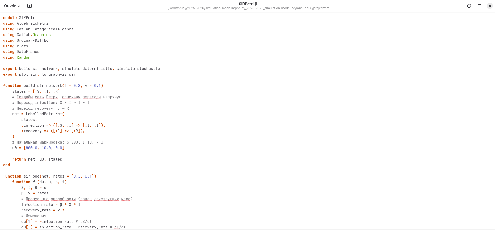{#fig-001 width=70%}

## 1. Код модели

Вывод в консоль.  

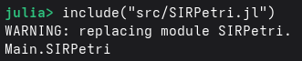{#fig-002 width=70%}

## 2. Базовый прогон модели

В задаче, мы объединим логику модели, произвестим расчеты и сохраним результаты.  

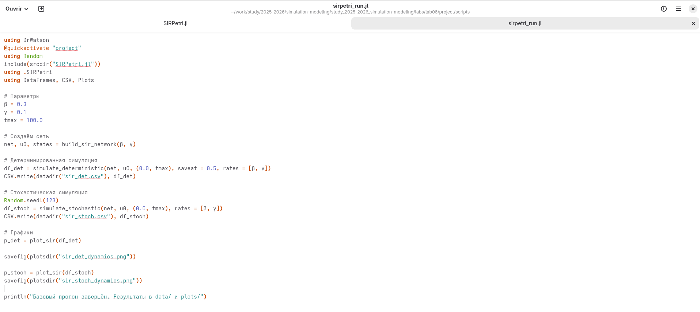{#fig-003 width=70%}

## 2. Базовый прогон модели

Мы используем библиотеку DrWatson, которая гарантирует, что пути к файлам и структура папок будут одинаковыми на любом компьютере.

Скрипт загружает модуль SIRPetri.jl и задает ключевые параметры болезни: коэффициент заражения (β = 0.3) и коэффициент выздоровления (γ = 0.1).

## 2. Базовый прогон модели

Детерминированный подход: Рассчитывает «средний» сценарий развития эпидемии. Это дает четкие, плавные кривые, полезные для общего прогноза.  ([рис. @fig-004]).

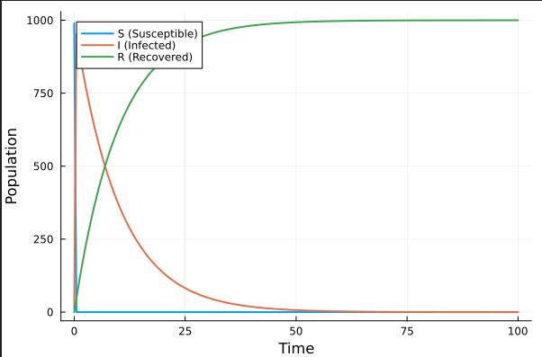{#fig-004 width=70%}

## 2. Базовый прогон модели

Стохастический подход: Учитывает фактор случайности (через Random.seed!). Это имитирует реальную жизнь, где каждое заражение или выздоровление — случайное событие. Сравнение этих двух подходов позволяет увидеть, насколько сильно случайность может отклонить эпидемию от теоретического среднего.  ([рис. @fig-005]).

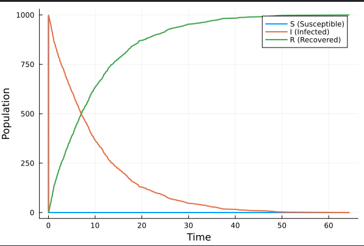{#fig-005 width=70%}

## 2. Базовый прогон модели

Первая таблица.  ([рис. @fig-006]).

{#fig-006 width=70%}

## 2 Базовый прогон модели

Вторая таблица.  ([рис. @fig-007]).

{#fig-007 width=70%}

## 2. Базовый прогон модели

Выполнение кода из jupyter notebook, всё работал хорошо.  

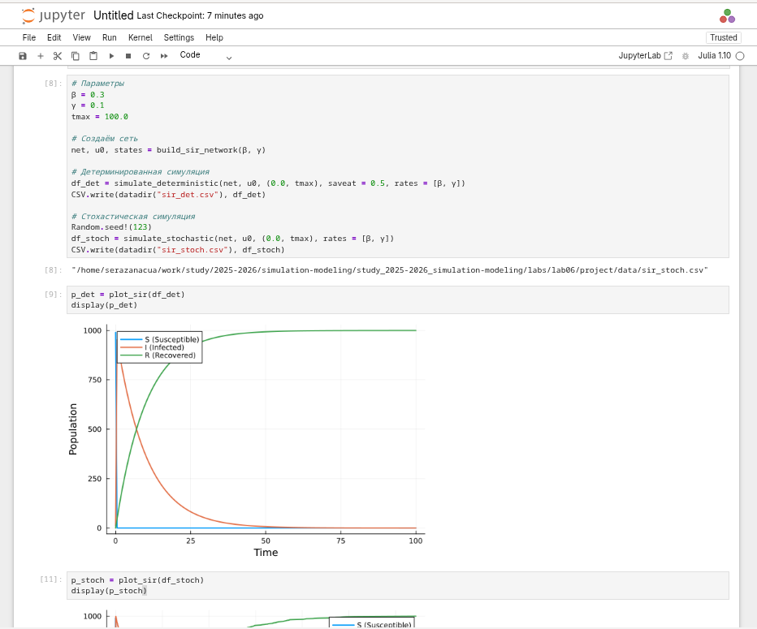{#fig-008 width=70%}

## 3. Коэффициент заражения β

Здесь я выяснила, как изменение интенсивности заражения (β) влияет на развитие эпидемии.  ([рис. @fig-009]).

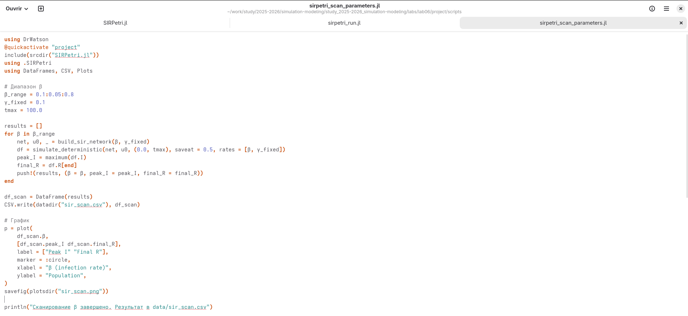{#fig-009 width=70%}

## 3. Коэффициент заражения β

Код запускает цикл симуляций, перебирая значения β от 0.1 до 0.8. Для каждого значения фиксируются два показателя:
- Пик заболеваемости (максимальная нагрузка на больницы).
- Итоговое число переболевших (общий масштаб эпидемии).  

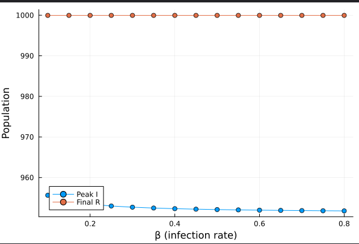{#fig-010 width=70%}

## 3. Коэффициент заражения β

Это исследовательская часть работы, которая показывает не просто один сценарий, а общую закономерность поведения модели.  

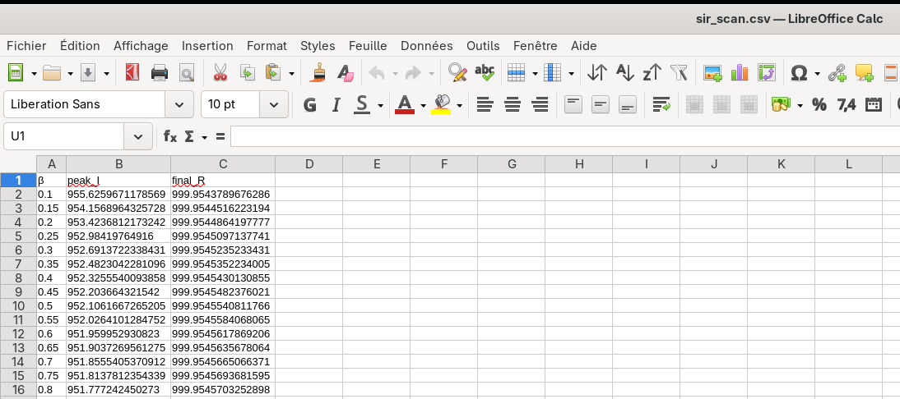{#fig-011 width=70%}

## 3. Коэффициент заражения β

Выполнение кода из jupyter notebook.  

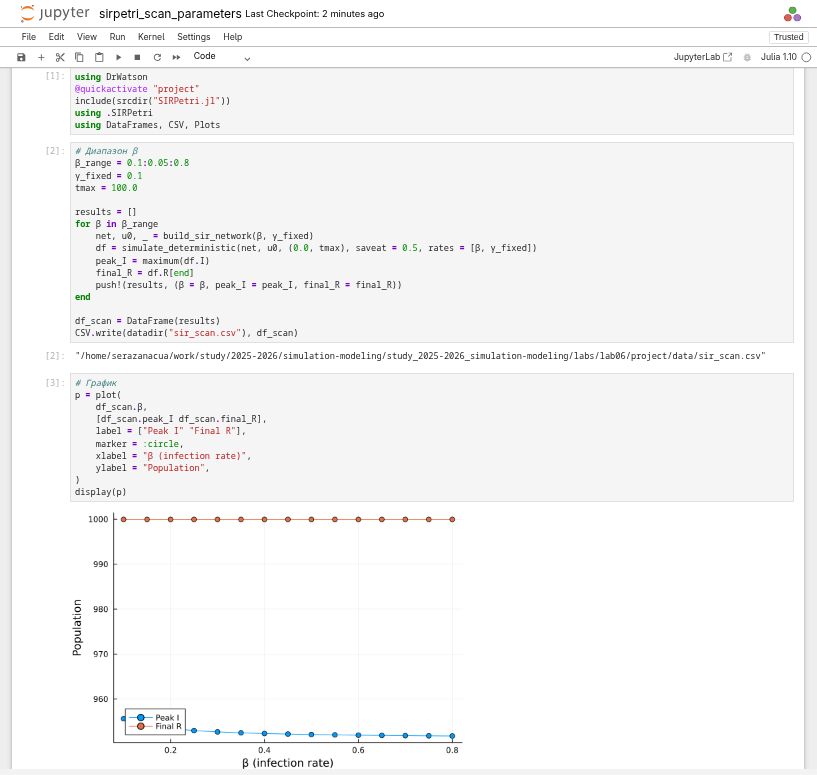{#fig-012 width=70%}

## 4. Итоговый отчёт

Здесь мы выполняем итоговый сравнительный анализ и визуализацию всех полученных данных.

1.  Интеграция результатов: Скрипт объединяет данные из разных симуляций, что позволяет проводить комплексный анализ без повторных вычислений.  

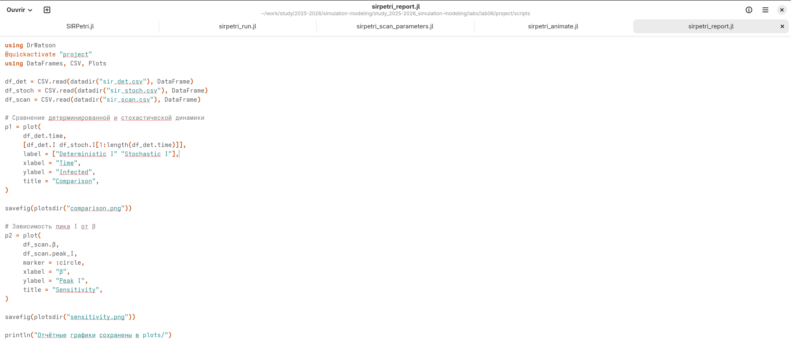{#fig-013 width=70%}

## 4. Итоговый отчёт

2.  Анализ отклонений: На графике сравнения (Comparison) наглядно демонстрируется, как случайные процессы в стохастической модели создают отклонения от теоретической средней кривой. 

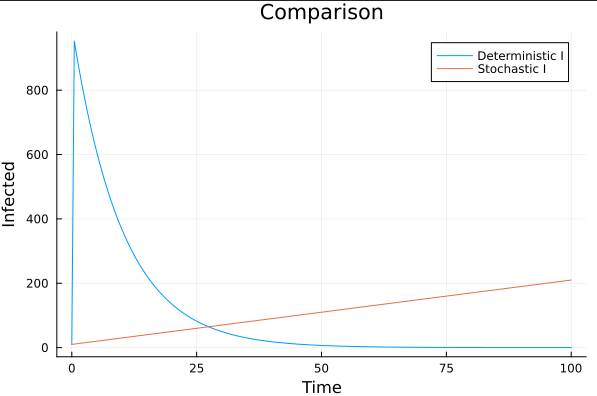{#fig-014 width=70%}

## 4. Итоговый отчёт

3.  Оценка рисков: График чувствительности (Sensitivity) связывает биологические параметры вируса с его опасностью для популяции (высотой пика заболеваемости).  

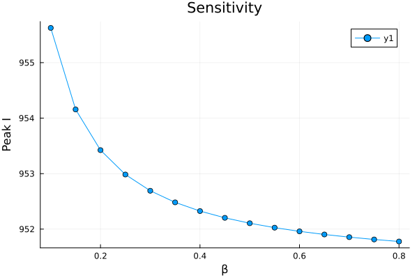{#fig-015 width=70%}

## 4. Итоговый отчёт

Выполнение кода из jupyter notebook.  

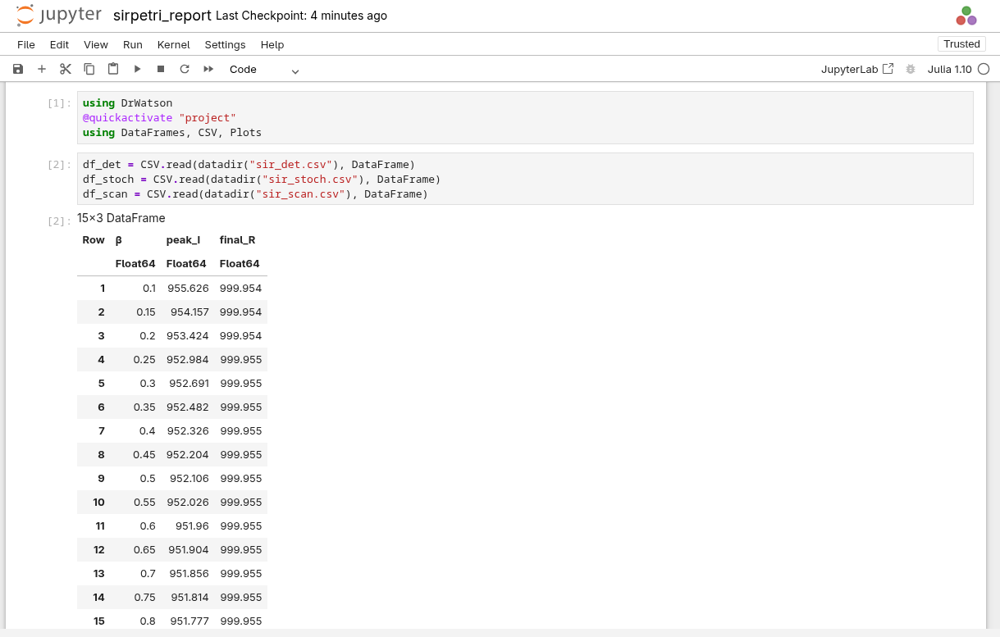{#fig-016 width=70%}

## 4. Итоговый отчёт

Выполнение кода из jupyter notebook.  

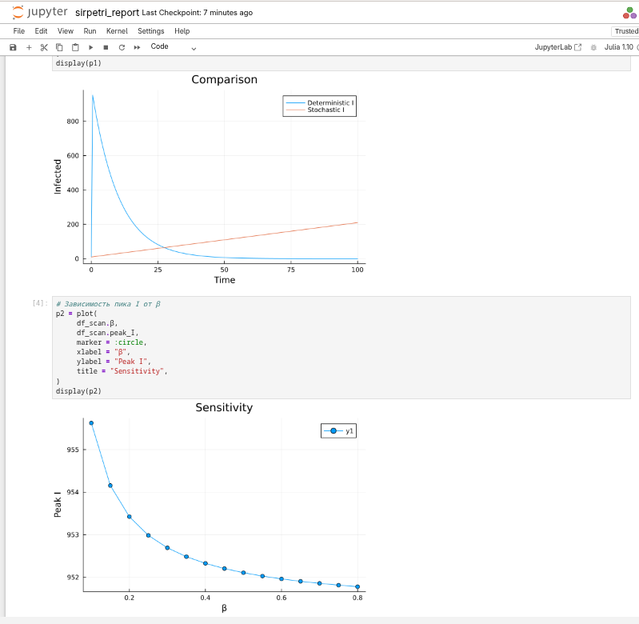{#fig-017 width=70%}

## Выводы

Мы прошли путь от описания модели через сети Петри до получения конкретных графиков, которые позволяют прогнозировать нагрузку на систему здравоохранения в зависимости от параметров инфекции.

## Список литературы{.unnumbered}

::: {#https://esystem.rudn.ru/pluginfile.php/3145800/mod_resource/content/1/lab06.pdf}
:::
