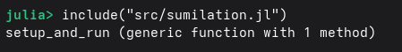
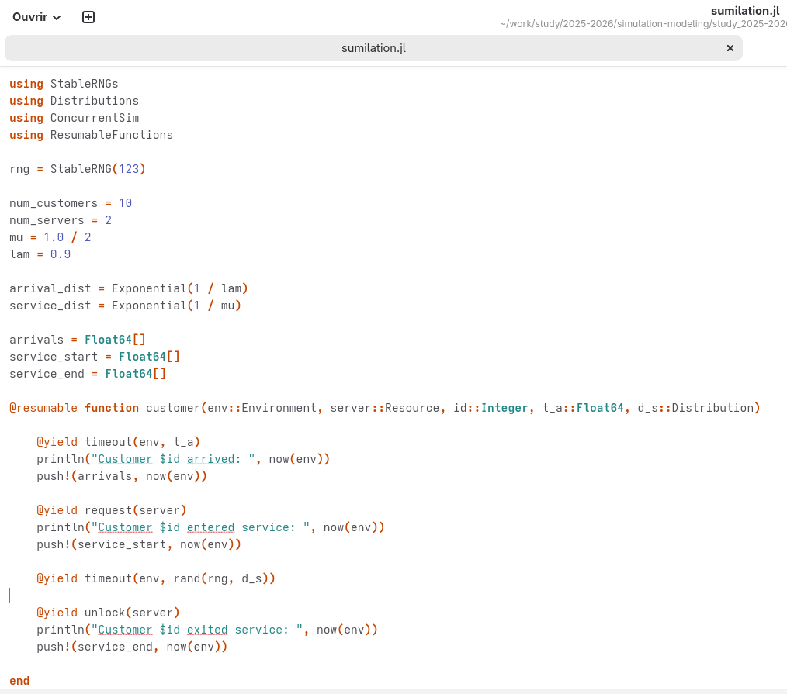
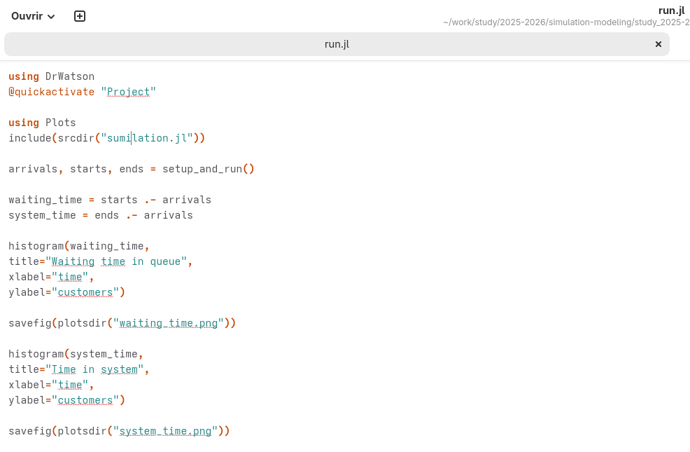
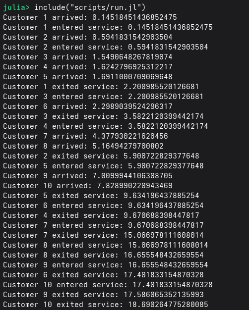
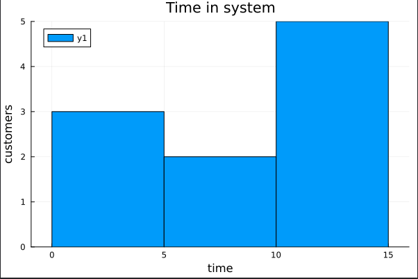
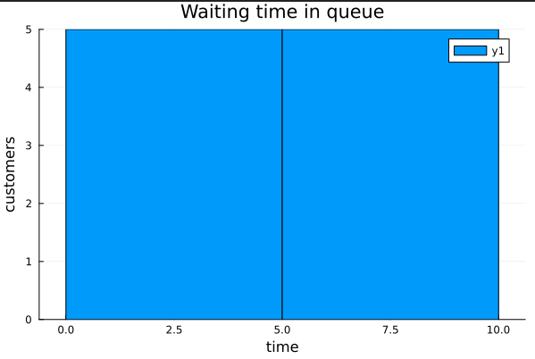
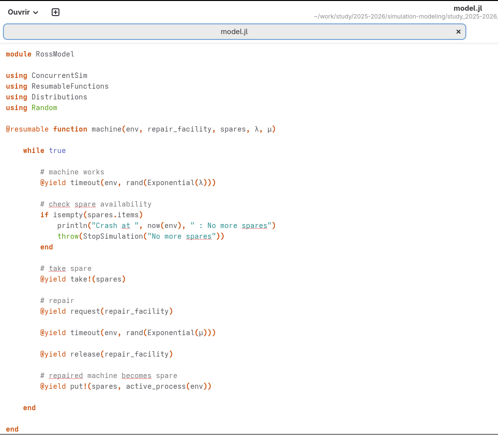
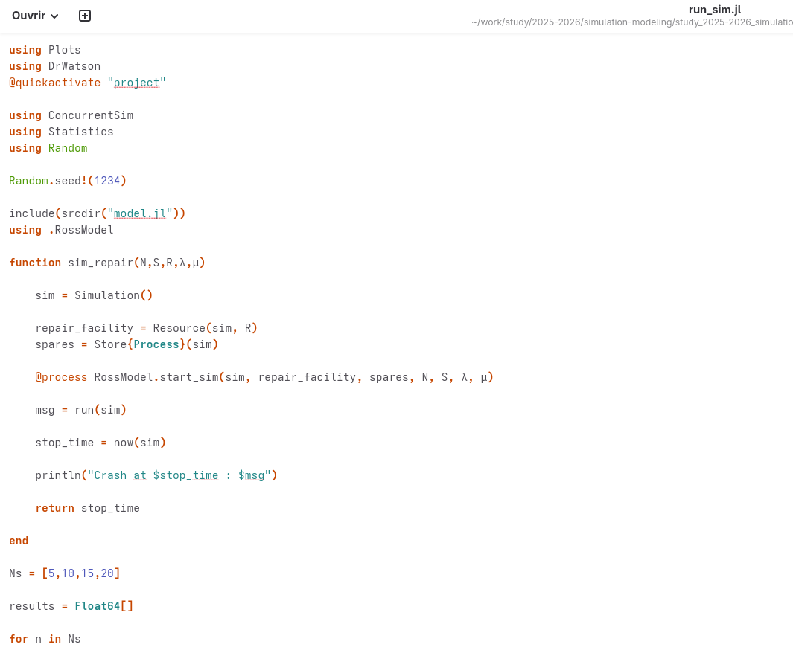
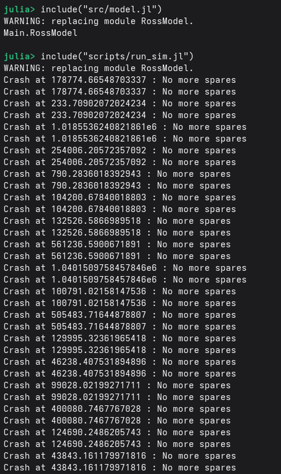
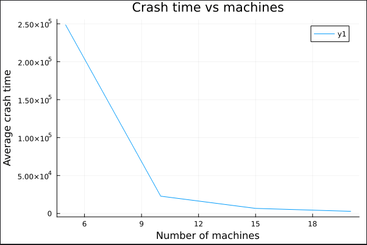

---
## Author
author:
  name: Разанацуа Сара Естэлл
  email: 1032225834@rudn.ru
  affiliation:
    - name: Российский университет дружбы народов
      country: Российская Федерация
      postal-code: 117198
      city: Москва
      address: ул. Миклухо-Маклая, д. 15

## Title
title: "Шаблон отчёта по лабораторной работе № 7"
subtitle: "Дискретно-событийное моделирование"
license: "CC BY"
---

# Цель работы

- изучить методы дискретно‑событийного моделирования и применить их для анализа работы системы ремонта машин с ограниченным количеством запасных частей и ремонтников.

# Задание

**  Модель M/M/c **

1. Переведите в структуру DrWatson.
2. Добавьте необходимые графики.

** Модель Росса **

1. Переведите в структуру DrWatson.
2. Добавьте нескольких ремонтников.
3. Сделайте прогон для разного количества машин.
4. Проведите мониторинг загрузки ремонтника, средней длины очереди на ремонт.
5. Построение графиков изменения числа исправных машин во времени.
6. Сравните с аналитическим решением.


# Теоретическое введение

## Модель M/M/c

Модель M/M/c (по классификации Кендалла) — это система массового обслуживания со следующими свойствами:

- M (Markovian) — входящий поток заявок пуассоновский, интервалы между прибытиями распределены экспоненциально с параметром λ.

- M — время обслуживания каждой заявки распределено экспоненциально с
параметром μ.
- c — количество идентичных обслуживающих приборов (каналов), работающих
параллельно.

## Модель Росса

- Модель представляет собой классический пример системы массового обслуживания с конечной популяцией, резервом и ремонтом.

** Формальная постановка задачи **

- В системе находятся 𝑁 идентичных машин, которые постоянно работают и могут выходить из строя.
- 𝑆 машин находятся в резерве и готовы немедленно заменить любую отказавшую.
- Одно ремонтное устройство (ремонтник), которое может одновременно ремонтировать только одну машину.
- Когда работающая машина ломается, происходит следующее:
1. Немедленно берётся одна резервная машина (если она есть) и запускается в работу вместо сломавшейся.
2. Сломанная машина отправляется в ремонт.
3. Если резерва нет, система падает (crash). Моделирование заканчивается.

- После ремонта машина пополняет пул резервных (становится исправной и ждёт).
- Требуется оценить среднее время до падения системы 𝐸[𝑇] при заданных распределениях наработк


# Выполнение лабораторной работы

## Модель M/M/c

- Сначала я создала файл "src/sumilation.jl" и написала код и запустила его. ([рис. @fig-001]).

{#fig-001 width=70%}

```Julia

function setup_and_run()

    sim = Simulation()
    server = Resource(sim, num_servers)

    arrival_time = 0.0

    for i in 1:num_customers
        arrival_time += rand(rng, arrival_dist)
        @process customer(sim, server, i, arrival_time, service_dist)
    end

    run(sim)

    return arrivals, service_start, service_end

end

```

- Код ([рис. @fig-007]).

{#fig-007 width=70%}

- Потом я создала файл "scripts/run.jl" и написала код и запустила его. ([рис. @fig-002]).

{#fig-002 width=70%}

- Мы получаем вот такой результат в консоле. ([рис. @fig-003]).

{#fig-003 width=70%}

- График 1 ([рис. @fig-004]).

{#fig-004 width=70%}

- График 2 ([рис. @fig-005]).

{#fig-005 width=70%}


## Модель Росса

- Сначала я создала файл "src/model.jl" и написала код и запустила его. ([рис. @fig-006]).

{#fig-006 width=70%}

```Julia

@resumable function start_sim(env, repair_facility, spares, N, S, λ, μ)

    # create spare machines
    for i in 1:S
        proc = @process machine(env, repair_facility, spares, λ, μ)
        @yield put!(spares, proc)
    end

    # create working machines
    for i in 1:N
        @process machine(env, repair_facility, spares, λ, μ)
    end

end

```

- Потом я создала файл "scripts/run_sum.jl" и написала код и запустила его. ([рис. @fig-008]).

{#fig-008 width=70%}

- Вывод в консоль. ([рис. @fig-009]).

{#fig-009 width=70%}

- График ([рис. @fig-010]).

{#fig-010 width=70%}


# Выводы

- Я выполнила лабораторную работу №7.


# Список литературы{.unnumbered}

<https://esystem.rudn.ru/pluginfile.php/3145800/mod_resource/content/1/lab07.pdf}>
