---
## Front matter
title: "Лабораторная работа №8"
subtitle: "Реализация основных моделей в дискретно-событийном подходе."
author: "Разанацуа Сара Естэлл"

## Generic otions
lang: ru-RU
toc-title: "Содержание"

## Bibliography
bibliography: bib/cite.bib
csl: pandoc/csl/gost-r-7-0-5-2008-numeric.csl

## Pdf output format
toc: true # Table of contents
toc-depth: 2
lof: true # List of figures
lot: true # List of tables
fontsize: 12pt
linestretch: 1.5
papersize: a4
documentclass: scrreprt
## I18n polyglossia
polyglossia-lang:
  name: russian
  options:
	- spelling=modern
	- babelshorthands=true
polyglossia-otherlangs:
  name: english
## I18n babel
babel-lang: russian
babel-otherlangs: english
## Fonts
mainfont: PT Serif
romanfont: PT Serif
sansfont: PT Sans
monofont: PT Mono
mainfontoptions: Ligatures=TeX
romanfontoptions: Ligatures=TeX
sansfontoptions: Ligatures=TeX,Scale=MatchLowercase
monofontoptions: Scale=MatchLowercase,Scale=0.9
## Biblatex
biblatex: true
biblio-style: "gost-numeric"
biblatexoptions:
  - parentracker=true
  - backend=biber
  - hyperref=auto
  - language=auto
  - autolang=other*
  - citestyle=gost-numeric
## Pandoc-crossref LaTeX customization
figureTitle: "Рис."
tableTitle: "Таблица"
listingTitle: "Листинг"
lofTitle: "Список иллюстраций"
lotTitle: "Список таблиц"
lolTitle: "Листинги"
## Misc options
indent: true
header-includes:
  - \usepackage{indentfirst}
  - \usepackage{float} # keep figures where there are in the text
  - \floatplacement{figure}{H} # keep figures where there are in the text
---

# Цель работы

- Изучить дискретно-событийный подход к имитационному моделированию на примере классической модели распространения инфекции SIR. Реализовать стохастическую дискретно-событийную модель в виде программного комплекса на языке Julia. Провести анализ влияния параметров, сравнить со стохастической и детерминированной версиями, оценить производительность и модифицировать модель.


# Задание

1. Программный комплекс
- Структура программы (sir_model.jl)
- Скрипт запуска (sir_des.jl)

2. Дополнительные задания
- Анализ чувствительности к параметрам
- Детерминированная длительность болезни
- Оценка производительности
- Сохранение результатов в CSV
- Добавление демографических событий
- Вакцинация
- Модель SEIR


# Теоретическое введение

## Программный комплекс

Программный комплекс состоит из двух основных файлов:
- src/sir_model.jl (ядро модели): определение структур данных, функций событий, логики агентов и управления симуляцией.

- scripts/sir_des.jl (скрипт запуска): задание параметров, инициализация модели, выполнение прогона и визуализация.


## Входные и выходные данные

**Входные данные**

1. Начальное состояние популяции u0 (вектор из трёх целых чисел): число восприимчивых, инфицированных и переболевших на момент времени 0.

2. Параметры модели p (вектор из трёх вещественных чисел):
- $/beta$ (вероятность передачи при контакте) – число от 0 до 1.
- $c$ (частота контактов) – среднее число контактов индивида в единицу модельного времени.
- $/gamma$ (интенсивность выздоровления) – величина > 0; обратная к среднему времени болезни.

3. Длительность симуляции tmax (вещественное число) – момент остановки модельного времени.

4. Зерно генератора случайных чисел – опционально, для воспроизводимости.

**Выходные данные**

1. Таблица DataFrame с колонками:
- $t$ – моменты времени наступления событий.
- $S$ – число восприимчивых.
- $I$ – число инфицированных.
- $R$ – число переболевших.

2. График временных рядов $S$, $I$, $R$, сохранённый в plots/sir_des.png.


# Выполнение лабораторной работы

## Программный комплекс

**Структура программы (sir_model.jl)**

- Здесь я создала ("src/sir_model.jl"), я написала код и запустила его.(рис. [-@fig:002]).

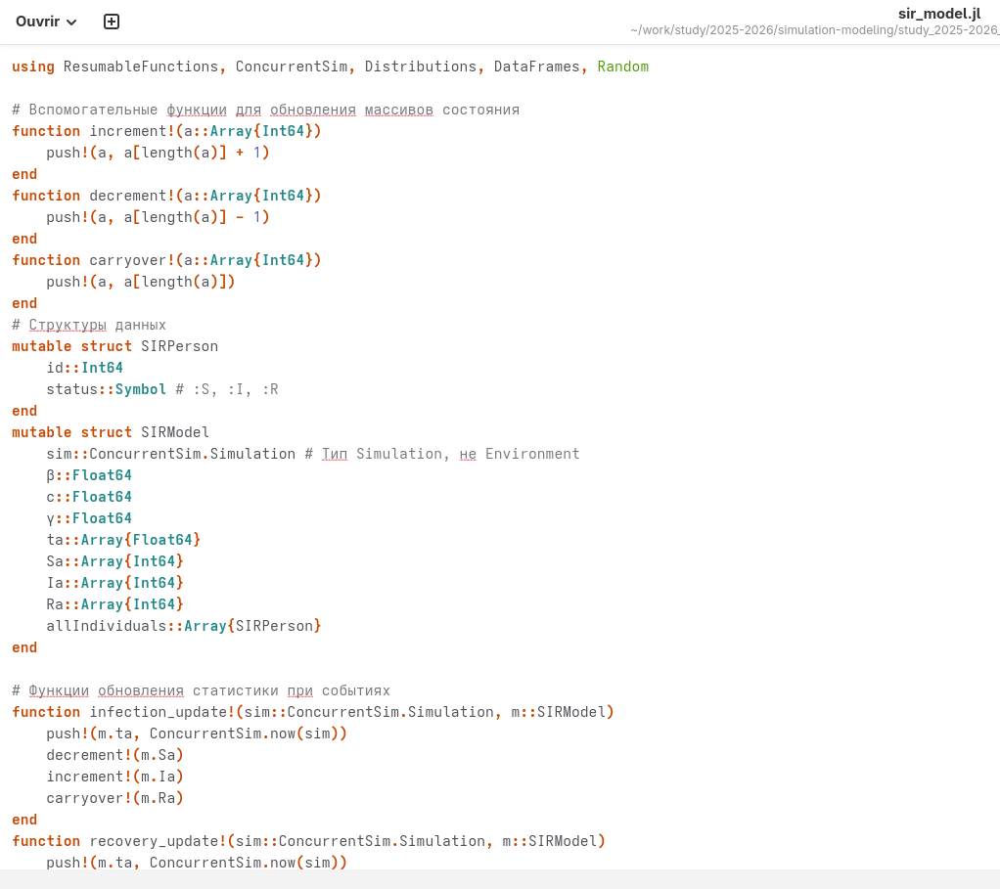{#fig:002 width=100%}

- Отображение на консоли. (рис. [-@fig:001]).

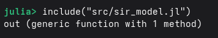{#fig:001 width=100%}


**Скрипт запуска (sir_des.jl)**

- Здесь я создала ("scripts/sir_des.jl"), я написала код и запустила его.(рис. [-@fig:003]).

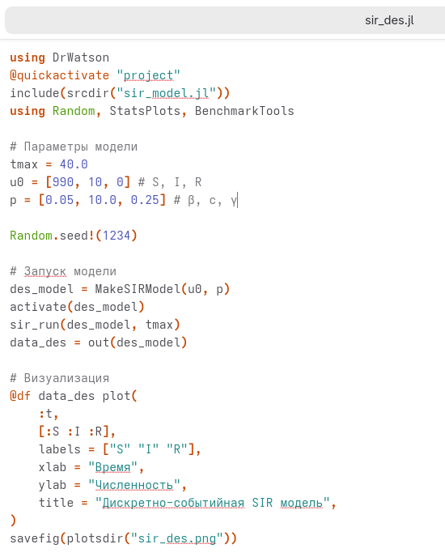{#fig:003 width=100%}

- График, который мы получили. (рис. [-@fig:004]).

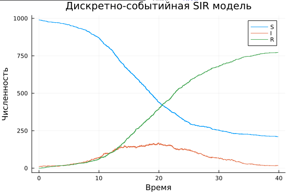{#fig:004 width=100%}


## Дополнительные задания

**Анализ чувствительности к параметрам**

- Написать цикл, варьирующий параметры и сохраняющий результаты. (рис. [-@fig:005]).

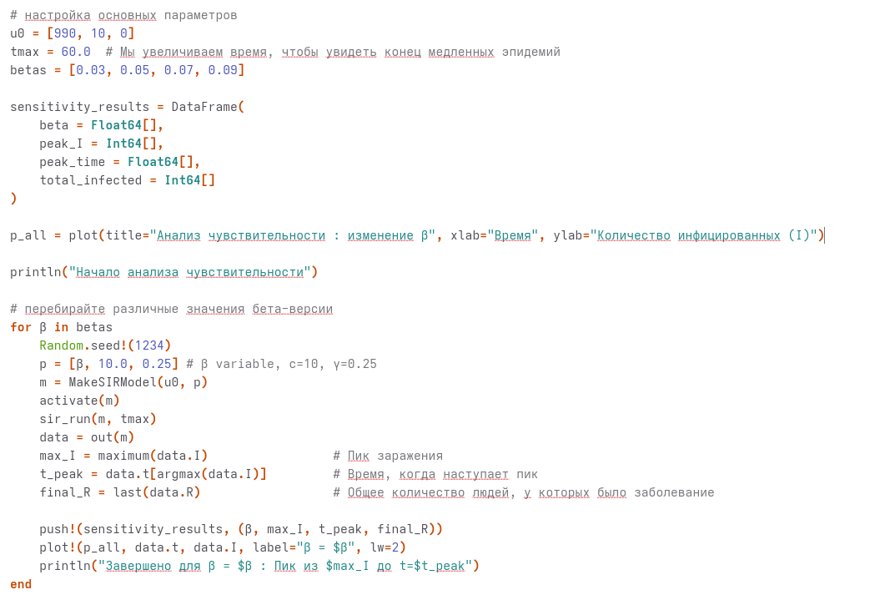{#fig:005 width=100%}

- Отображение на консоли. (рис. [-@fig:006]).

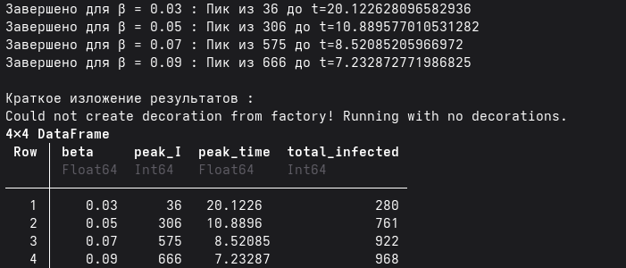{#fig:006 width=100%}

- График, который мы получили. (рис. [-@fig:007]).

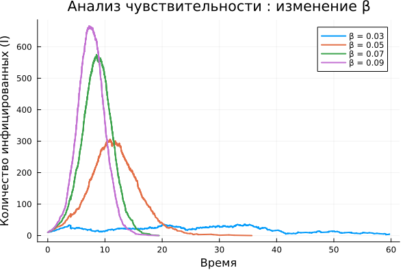{#fig:007 width=100%}


**Детерминированная длительность болезни**

- В src/sir_model.jl в функции live заменить строку

```Julia
@yield timeout(env, rand(Exponential(1/m.$/gamma$)))
```
на

```Julia
@yield timeout(env, 1/m.$/gamma$)
```

(рис. [-@fig:008]).

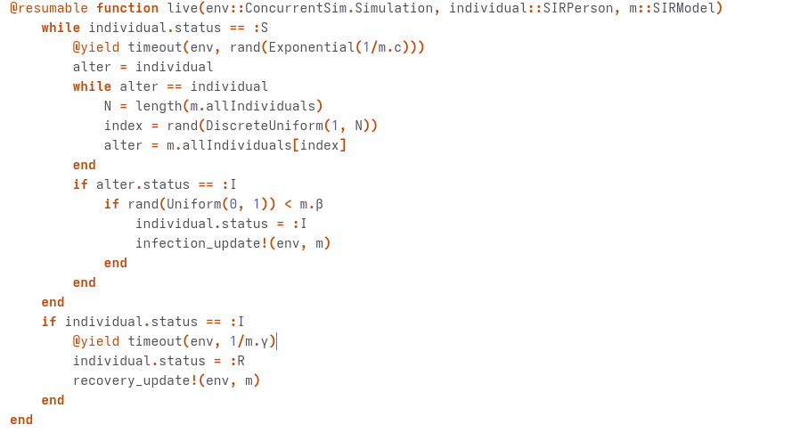{#fig:008 width=100%}


**Оценка производительности**

Добавить в скрипт:

```Julia
using BenchmarkTools
@benchmark sir_run(des_model, tmax)
```
(рис. [-@fig:009]).

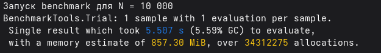{#fig:009 width=100%}


**Вакцинация**

- Мы добавим в модель срабатывание события вакцинации по таймеру (рис. [-@fig:010]).

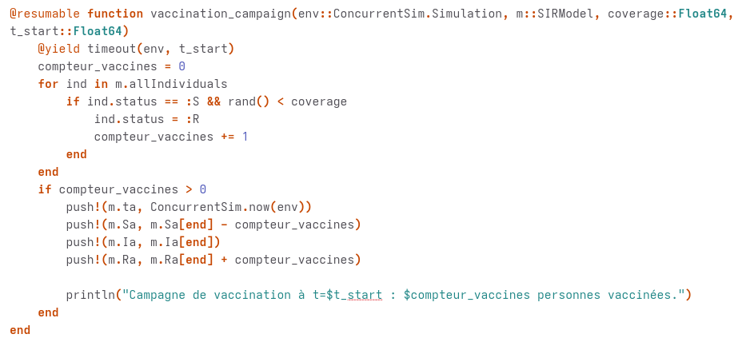{#fig:010 width=100%}


**Модель SEIR**

- Ввести латентный период (статус :E). После заражения индивид переходит в :E и через время, распределённое экспоненциально с параметром $/sigma$, становится инфекционным (:I). Оценить, как меняется динамика по сравнению с SIR.

- Отображение на консоли. (рис. [-@fig:011]).

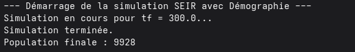{#fig:011 width=100%}

- График, который мы получили. (рис. [-@fig:012]).

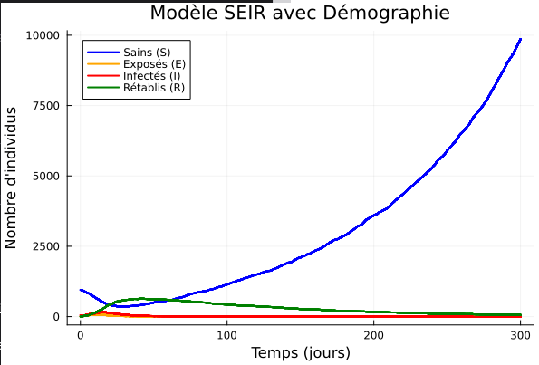{#fig:012 width=100%}


# Выводы

- В результате выполнения лабораторной работы была Реализация основных моделей в дискретно-событийном подходе.

# Список литературы{.unnumbered}

<https://esystem.rudn.ru/pluginfile.php/3145800/mod_resource/content/1/lab08.pdf}>
